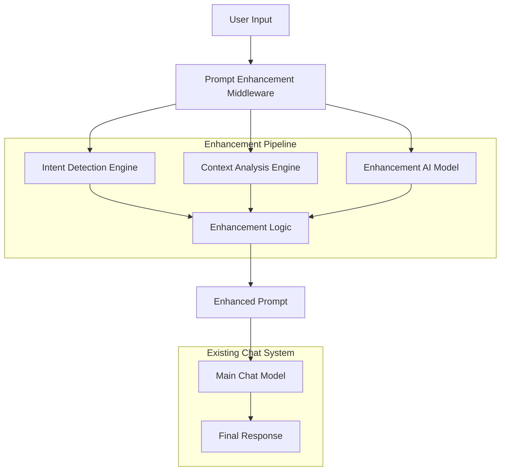
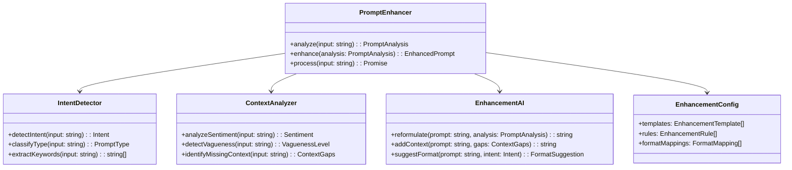
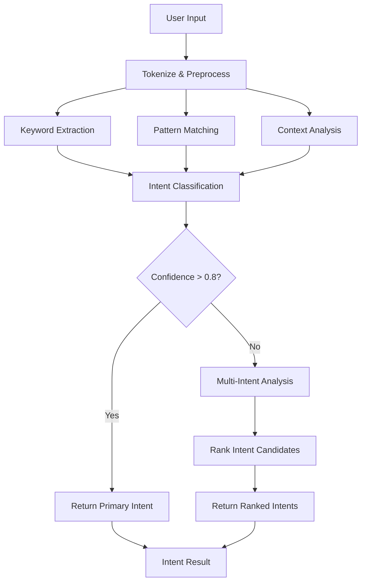
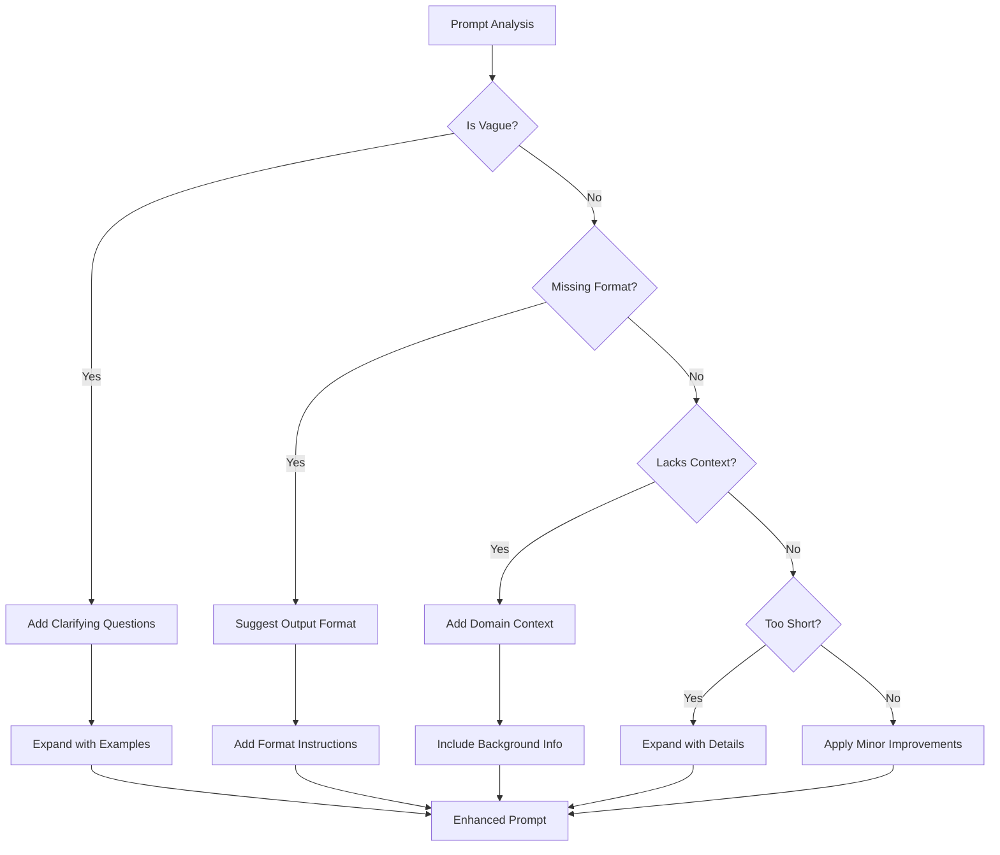
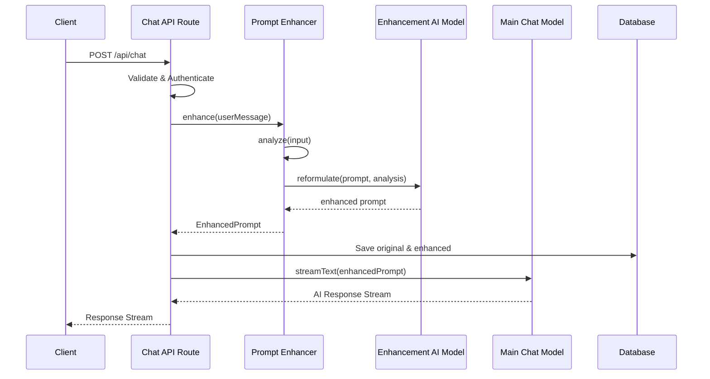
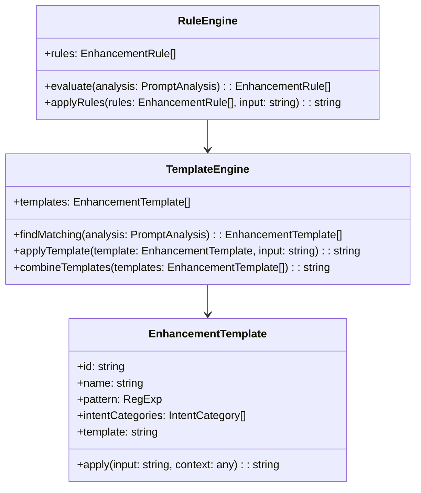
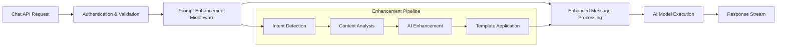

# Intelligent Prompt Enhancement Middleware

## Overview

The Intelligent Prompt Enhancement Middleware is a preprocessing layer that intercepts user inputs before they reach the main chat model. This middleware analyzes user prompts for intent, sentiment, and context, then enhances or reformulates them to optimize the final response quality and format.

### Core Objectives

- **Intent Detection**: Automatically identify what the user is trying to achieve
- **Context Enhancement**: Add missing context and formatting specifications
- **Prompt Clarification**: Transform vague requests into specific, actionable queries
- **Format Optimization**: Suggest structured output formats when beneficial
- **Response Quality**: Improve the relevance and usefulness of AI responses

### Value Proposition

- Reduces user effort in crafting effective prompts
- Ensures consistent, high-quality responses regardless of user prompt sophistication
- Improves user experience by anticipating needs and providing better formatted responses
- Bridges the gap between casual user input and optimal AI model interaction

## Architecture

### System Integration



### Component Architecture



## Data Models & Type Definitions

### Core Types

```typescript
interface PromptAnalysis {
  intent: Intent;
  sentiment: Sentiment;
  vaguenessLevel: VaguenessLevel;
  contextGaps: ContextGaps;
  promptType: PromptType;
  keywords: string[];
  complexity: ComplexityLevel;
}

interface Intent {
  category: IntentCategory;
  action: string;
  subject: string;
  confidence: number;
}

interface Sentiment {
  polarity: 'positive' | 'negative' | 'neutral';
  intensity: number;
  emotion?: EmotionType;
}

interface ContextGaps {
  missingFormat: FormatType[];
  missingDetails: string[];
  ambiguousTerms: string[];
  implicitRequirements: string[];
}

interface EnhancedPrompt {
  original: string;
  enhanced: string;
  changes: Enhancement[];
  confidence: number;
  processingTime: number;
}

interface Enhancement {
  type: EnhancementType;
  description: string;
  section: string;
  rationale: string;
}
```

### Enums and Constants

```typescript
enum IntentCategory {
  INFORMATION_REQUEST = 'information_request',
  TASK_EXECUTION = 'task_execution',
  CREATIVE_WRITING = 'creative_writing',
  CODE_GENERATION = 'code_generation',
  ANALYSIS = 'analysis',
  COMPARISON = 'comparison',
  EXPLANATION = 'explanation',
  TROUBLESHOOTING = 'troubleshooting'
}

enum PromptType {
  SINGLE_QUESTION = 'single_question',
  MULTI_PART_REQUEST = 'multi_part_request',
  VAGUE_INQUIRY = 'vague_inquiry',
  SPECIFIC_TASK = 'specific_task',
  CONVERSATIONAL = 'conversational'
}

enum EnhancementType {
  CONTEXT_ADDITION = 'context_addition',
  FORMAT_SPECIFICATION = 'format_specification',
  CLARIFICATION = 'clarification',
  DETAIL_EXPANSION = 'detail_expansion',
  STRUCTURE_IMPROVEMENT = 'structure_improvement'
}

enum FormatType {
  TABLE = 'table',
  LIST = 'list',
  STEP_BY_STEP = 'step_by_step',
  CODE_BLOCK = 'code_block',
  COMPARISON_CHART = 'comparison_chart',
  EXAMPLE_BASED = 'example_based'
}
```

## Enhancement Engine Implementation

### Intent Detection Logic



### Enhancement Decision Tree



## API Integration Layer

### Middleware Integration with Chat API



### Enhanced Chat Route Structure

```typescript
// Modified chat route with enhancement middleware
export async function POST(request: Request) {
  // ... existing validation and auth logic
  
  const { message, selectedChatModel, selectedVisibilityType } = requestBody;
  
  // Enhancement middleware integration
  const enhancedMessage = await enhancePrompt(message, {
    userContext: session.user,
    chatHistory: uiMessages,
    selectedModel: selectedChatModel,
    requestHints
  });
  
  // Save both original and enhanced messages
  await saveMessages({
    messages: [
      {
        chatId: id,
        id: message.id,
        role: 'user',
        parts: message.parts,
        attachments: [],
        createdAt: new Date(),
        metadata: {
          original: message.parts,
          enhanced: enhancedMessage.parts,
          enhancements: enhancedMessage.enhancements
        }
      }
    ]
  });
  
  // Use enhanced message for AI processing
  const stream = createUIMessageStream({
    execute: ({ writer: dataStream }) => {
      const result = streamText({
        model: myProvider.languageModel(selectedChatModel),
        system: systemPrompt({ selectedChatModel, requestHints }),
        messages: convertToModelMessages([...uiMessages, enhancedMessage]),
        // ... rest of existing configuration
      });
      // ... rest of existing stream logic
    }
  });
}
```

## Enhancement Templates & Rules

### Template System



### Configuration Examples

```typescript
const enhancementTemplates: EnhancementTemplate[] = [
  {
    id: 'vague_request_clarification',
    name: 'Vague Request Clarification',
    pattern: /^(what|how|why|when|where).{0,20}$/i,
    intentCategories: [IntentCategory.INFORMATION_REQUEST],
    template: `
      Based on your question about {subject}, I'll provide a comprehensive response.
      To give you the most helpful answer, I'll cover:
      - {expandedContext}
      - Practical examples and applications
      - Key considerations and best practices
      
      {originalPrompt}
    `,
    apply: (input: string, context: any) => {
      // Template application logic
    }
  },
  
  {
    id: 'code_request_enhancement',
    name: 'Code Request Enhancement',
    pattern: /(write|create|generate|build).*(code|script|function|program)/i,
    intentCategories: [IntentCategory.CODE_GENERATION],
    template: `
      Please create {codeType} that accomplishes the following:
      
      Requirements:
      {enhancedRequirements}
      
      Format the response as:
      1. Brief explanation of the approach
      2. Complete, well-commented code
      3. Usage example
      4. Any important considerations or limitations
      
      {originalPrompt}
    `
  },
  
  {
    id: 'comparison_request',
    name: 'Comparison Request Enhancement',
    pattern: /(compare|versus|vs|difference|better)/i,
    intentCategories: [IntentCategory.COMPARISON],
    template: `
      Please provide a detailed comparison addressing:
      
      {originalPrompt}
      
      Structure your response as:
      1. Overview of items being compared
      2. Comparison table with key criteria
      3. Pros and cons for each option
      4. Recommendations based on different use cases
    `
  }
];
```

## Configuration Management

### Enhancement Configuration

```typescript
interface EnhancementConfig {
  // Model configuration for enhancement AI
  enhancementModel: {
    modelId: string;
    maxTokens: number;
    temperature: number;
    systemPrompt: string;
  };
  
  // Processing thresholds
  thresholds: {
    vaguenessThreshold: number;
    confidenceThreshold: number;
    processingTimeLimit: number;
    maxEnhancementLength: number;
  };
  
  // Feature flags
  features: {
    intentDetection: boolean;
    contextEnhancement: boolean;
    formatSuggestion: boolean;
    sentimentAnalysis: boolean;
  };
  
  // Enhancement rules
  rules: {
    expandShortPrompts: boolean;
    addFormatInstructions: boolean;
    includeExamples: boolean;
    clarifyAmbiguity: boolean;
  };
}

const defaultConfig: EnhancementConfig = {
  enhancementModel: {
    modelId: 'suggestion-model', // Reuse existing model
    maxTokens: 500,
    temperature: 0.3,
    systemPrompt: enhancementSystemPrompt
  },
  thresholds: {
    vaguenessThreshold: 0.7,
    confidenceThreshold: 0.8,
    processingTimeLimit: 2000, // 2 seconds
    maxEnhancementLength: 1000
  },
  features: {
    intentDetection: true,
    contextEnhancement: true,
    formatSuggestion: true,
    sentimentAnalysis: true
  },
  rules: {
    expandShortPrompts: true,
    addFormatInstructions: true,
    includeExamples: false, // Default off to avoid over-verbosity
    clarifyAmbiguity: true
  }
};
```

## Implementation Strategy

### File Structure

```
lib/
├── ai/
│   ├── enhancement/
│   │   ├── prompt-enhancer.ts         # Main enhancement engine
│   │   ├── intent-detector.ts         # Intent detection logic
│   │   ├── context-analyzer.ts        # Context analysis engine
│   │   ├── enhancement-ai.ts          # AI model interface
│   │   ├── template-engine.ts         # Template processing
│   │   ├── enhancement-config.ts      # Configuration management
│   │   └── types.ts                   # Enhancement-specific types
│   └── prompts/
│       └── enhancement-prompts.ts     # Enhancement AI prompts
```

### Core Enhancement Engine

```typescript
export class PromptEnhancer {
  private intentDetector: IntentDetector;
  private contextAnalyzer: ContextAnalyzer;
  private enhancementAI: EnhancementAI;
  private templateEngine: TemplateEngine;
  private config: EnhancementConfig;
  
  constructor(config: EnhancementConfig) {
    this.config = config;
    this.intentDetector = new IntentDetector();
    this.contextAnalyzer = new ContextAnalyzer();
    this.enhancementAI = new EnhancementAI(config.enhancementModel);
    this.templateEngine = new TemplateEngine(config.templates);
  }
  
  async process(input: string, context: EnhancementContext): Promise<EnhancedPrompt> {
    const startTime = Date.now();
    
    try {
      // Step 1: Analyze the input
      const analysis = await this.analyze(input, context);
      
      // Step 2: Determine if enhancement is needed
      if (!this.shouldEnhance(analysis)) {
        return {
          original: input,
          enhanced: input,
          changes: [],
          confidence: 1.0,
          processingTime: Date.now() - startTime
        };
      }
      
      // Step 3: Apply enhancements
      const enhanced = await this.enhance(input, analysis, context);
      
      return {
        original: input,
        enhanced: enhanced.text,
        changes: enhanced.changes,
        confidence: enhanced.confidence,
        processingTime: Date.now() - startTime
      };
      
    } catch (error) {
      console.error('Enhancement failed:', error);
      // Fallback to original input
      return {
        original: input,
        enhanced: input,
        changes: [],
        confidence: 0.0,
        processingTime: Date.now() - startTime
      };
    }
  }
  
  private async analyze(input: string, context: EnhancementContext): Promise<PromptAnalysis> {
    const [intent, sentiment, vagueness, gaps] = await Promise.all([
      this.intentDetector.detectIntent(input),
      this.contextAnalyzer.analyzeSentiment(input),
      this.contextAnalyzer.detectVagueness(input),
      this.contextAnalyzer.identifyMissingContext(input, context)
    ]);
    
    return {
      intent,
      sentiment,
      vaguenessLevel: vagueness,
      contextGaps: gaps,
      promptType: this.intentDetector.classifyType(input),
      keywords: this.intentDetector.extractKeywords(input),
      complexity: this.assessComplexity(input)
    };
  }
  
  private shouldEnhance(analysis: PromptAnalysis): boolean {
    const { thresholds } = this.config;
    
    return (
      analysis.vaguenessLevel > thresholds.vaguenessThreshold ||
      analysis.contextGaps.missingFormat.length > 0 ||
      analysis.contextGaps.missingDetails.length > 0 ||
      analysis.promptType === PromptType.VAGUE_INQUIRY
    );
  }
}
```

### Integration Points



## Testing Strategy

### Unit Testing

```typescript
describe('PromptEnhancer', () => {
  describe('Intent Detection', () => {
    it('should identify code generation requests', async () => {
      const input = "write a function";
      const analysis = await enhancer.analyze(input, context);
      expect(analysis.intent.category).toBe(IntentCategory.CODE_GENERATION);
    });
    
    it('should detect vague requests', async () => {
      const input = "help me";
      const analysis = await enhancer.analyze(input, context);
      expect(analysis.vaguenessLevel).toBeGreaterThan(0.8);
    });
  });
  
  describe('Enhancement Logic', () => {
    it('should add format specifications for comparison requests', async () => {
      const input = "compare React and Vue";
      const result = await enhancer.process(input, context);
      expect(result.enhanced).toContain('comparison table');
    });
    
    it('should expand short prompts with context', async () => {
      const input = "API docs";
      const result = await enhancer.process(input, context);
      expect(result.enhanced.length).toBeGreaterThan(input.length);
    });
  });
});
```

### Integration Testing

```typescript
describe('Chat API with Enhancement', () => {
  it('should enhance prompts before sending to main model', async () => {
    const response = await request(app)
      .post('/api/chat')
      .send({
        id: 'test-chat',
        message: { parts: [{ type: 'text', text: 'help with coding' }] },
        selectedChatModel: 'chat-model',
        selectedVisibilityType: 'private'
      });
      
    expect(response.status).toBe(200);
    // Verify enhancement was applied by checking saved message metadata
  });
});
```

### Performance Testing

```typescript
describe('Enhancement Performance', () => {
  it('should complete enhancement within time limit', async () => {
    const input = "write a complex application";
    const startTime = Date.now();
    
    const result = await enhancer.process(input, context);
    const processingTime = Date.now() - startTime;
    
    expect(processingTime).toBeLessThan(2000); // 2 second limit
    expect(result.processingTime).toBeLessThan(2000);
  });
  
  it('should handle concurrent enhancement requests', async () => {
    const inputs = Array(10).fill(0).map((_, i) => `test prompt ${i}`);
    const promises = inputs.map(input => enhancer.process(input, context));
    
    const results = await Promise.all(promises);
    expect(results).toHaveLength(10);
    results.forEach(result => {
      expect(result.enhanced).toBeDefined();
    });
  });
});
```