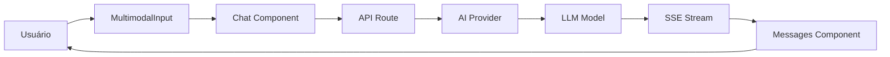
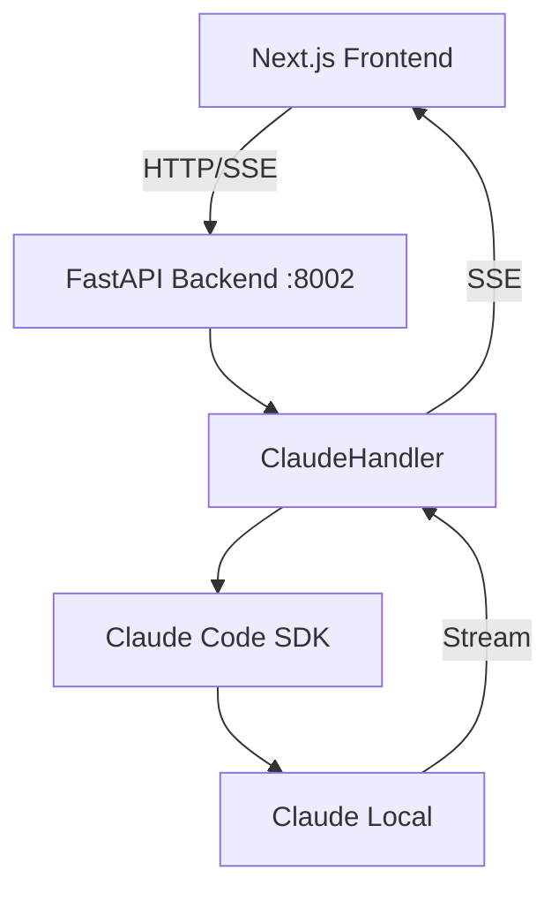

# Análise Detalhada da Arquitetura - AI Chatbot

## 📊 Resumo Executivo

O AI Chatbot é uma aplicação Next.js 15 com integração híbrida de LLMs, incluindo suporte para Claude Code SDK (rodando localmente) e modelos Grok via API Gateway. A arquitetura utiliza streaming em tempo real, autenticação via Auth.js, e um backend Python auxiliar para o Claude SDK.

## 🏗️ Arquitetura Geral

### Stack Tecnológico

#### Frontend
- **Framework**: Next.js 15.3.0-canary.31 (App Router)
- **UI**: React 19 RC + Tailwind CSS
- **Estado**: Zustand + SWR
- **Streaming**: AI SDK v5 + SSE (Server-Sent Events)
- **Componentes**: Radix UI + shadcn/ui pattern
- **Editor**: CodeMirror + ProseMirror

#### Backend
- **API Principal**: Next.js API Routes (TypeScript)
- **API Auxiliar**: FastAPI (Python) para Claude SDK
- **Banco de Dados**: PostgreSQL via Drizzle ORM
- **Cache**: Redis (opcional para resumable streams)
- **Autenticação**: NextAuth v5 beta

## 📁 Estrutura de Diretórios

```
ai-chatbot/
├── app/                        # Next.js App Router
│   ├── (auth)/                # Páginas e lógica de autenticação
│   │   ├── auth.ts           # Config NextAuth
│   │   ├── login/            # Página de login
│   │   ├── register/         # Página de registro
│   │   └── api/auth/         # Rotas de autenticação
│   └── (chat)/               # Área principal do chat
│       ├── page.tsx          # Página principal do chat
│       └── api/              # API Routes
│           ├── chat/         # Endpoint principal do chat
│           ├── document/     # Manipulação de documentos
│           ├── vote/         # Sistema de votação
│           └── history/      # Histórico de conversas
├── components/               # Componentes React
│   ├── chat.tsx             # Componente principal do chat
│   ├── message.tsx          # Renderização de mensagens
│   ├── streaming-markdown.tsx # Streaming visual caractere por caractere
│   ├── artifact.tsx         # Sistema de artefatos (código, docs)
│   └── multimodal-input.tsx # Input com suporte a anexos
├── lib/
│   ├── ai/                  # Configuração de IA
│   │   ├── providers.ts     # Providers de modelos
│   │   ├── models.ts        # Definição de modelos disponíveis
│   │   ├── providers/
│   │   │   └── claude-sdk.ts # Provider customizado para Claude
│   │   └── tools/           # Ferramentas de IA
│   └── db/                  # Camada de banco de dados
│       ├── schema.ts        # Schema Drizzle
│       └── queries.ts       # Queries do banco
├── api-python/              # Backend Python para Claude SDK
│   ├── server.py           # Servidor FastAPI
│   ├── claude_handler.py   # Gerenciador de sessões Claude
│   └── auth_bridge.py      # Bridge de autenticação JWT
└── hooks/                   # React hooks customizados
    ├── use-artifact.ts      # Gerenciamento de artefatos
    ├── use-chat-visibility.ts # Visibilidade do chat
    └── use-messages.tsx     # Manipulação de mensagens
```

## 🔄 Fluxo de Dados

### 1. Fluxo de Chat Principal



### 2. Integração Claude SDK



## 🔐 Sistema de Autenticação

### Implementação
- **NextAuth v5 Beta**: Gerenciamento de sessões
- **Tipos de Usuário**: 
  - `guest`: Usuários temporários
  - `regular`: Usuários registrados
- **JWT Bridge**: Compartilhamento de auth entre Next.js e Python
- **Sessões**: Armazenadas em memória (Python) e banco (Next.js)

### Fluxo de Autenticação
1. Login/Registro via NextAuth
2. JWT gerado com `AUTH_SECRET`
3. Token enviado no header Authorization
4. Python valida token usando mesma secret
5. Sessões isoladas por usuário

## 💬 Sistema de Streaming

### Implementação em Camadas

#### 1. Backend Python (SSE)
```python
# Server-Sent Events para streaming real-time
async def generate_stream():
    yield {"event": "message", "data": json.dumps(response)}
```

#### 2. Provider Claude SDK (TypeScript)
```typescript
// Processa SSE e converte para formato AI SDK
async *streamText(): AsyncGenerator<any> {
    // Parse SSE events
    // Yield text-delta events
}
```

#### 3. Componente Visual (React)
```typescript
// StreamingMarkdown.tsx - Animação caractere por caractere
const typeSpeed = isUser ? 10 : 20; // ms por caractere
```

## 🎯 Modelos Disponíveis

### Configurados em `lib/ai/models.ts`:
1. **Grok Vision** (`chat-model`)
   - Modelo multimodal padrão
   - Via API Gateway

2. **Grok Reasoning** (`chat-model-reasoning`)
   - Chain-of-thought reasoning
   - Extração de tags `<think>`

3. **Claude Code Local** (`claude-code-sdk`)
   - Roda localmente sem API keys
   - Via backend Python

## 📡 Endpoints e Rotas

### API Routes (Next.js)
- `POST /api/chat` - Chat principal
- `GET /api/history` - Histórico de conversas
- `POST /api/document` - Criar/editar documentos
- `POST /api/vote` - Sistema de votação
- `GET /api/suggestions` - Sugestões de prompts

### API Python (FastAPI)
- `POST /api/claude/chat` - Stream de chat Claude
- `POST /api/claude/interrupt/{id}` - Interromper execução
- `POST /api/claude/clear/{id}` - Limpar contexto
- `DELETE /api/claude/session/{id}` - Deletar sessão
- `GET /api/claude/sessions` - Listar sessões

## 🗄️ Banco de Dados

### Schema Principal (Drizzle ORM)
- **users**: Usuários do sistema
- **chats**: Conversas
- **messages**: Mensagens individuais
- **votes**: Votações em mensagens
- **documents**: Artefatos criados
- **suggestions**: Sugestões de prompts

### Sessões (Em Memória - Python)
```python
sessions = {
    'session_id': {
        'user_id': str,
        'created_at': float,
        'message_count': int,
        'active': bool
    }
}
```

## 🚀 Funcionalidades Principais

### 1. Chat Multimodal
- Suporte a texto e imagens
- Anexos via drag-and-drop
- Preview de arquivos

### 2. Sistema de Artefatos
- Criação de código executável
- Documentos editáveis
- Planilhas interativas
- Renderização de markdown

### 3. Streaming Visual
- Animação caractere por caractere
- Velocidades diferenciadas (user/assistant)
- Cursor piscante durante digitação

### 4. Gerenciamento de Sessões
- Múltiplas conversas simultâneas
- Contexto persistente
- Limpeza automática de sessões antigas

### 5. Histórico e Persistência
- Salvamento automático de conversas
- Busca em histórico
- Exportação de conversas

## ⚙️ Configuração e Variáveis de Ambiente

### Essenciais
```env
# Autenticação
AUTH_SECRET=your-secret-key
AUTH_URL=http://localhost:3033

# Claude SDK
CLAUDE_SDK_API_URL=http://127.0.0.1:8002
NEXT_PUBLIC_CLAUDE_SDK_API_URL=http://127.0.0.1:8002

# Banco de Dados
POSTGRES_URL=postgresql://...

# Desenvolvimento
NODE_ENV=development
```

### Opcionais
```env
# Redis (resumable streams)
REDIS_URL=redis://...

# Analytics
VERCEL_ANALYTICS_ID=...

# AI Gateway
GATEWAY_API_KEY=...
```

## 🔧 Scripts de Build e Deploy

### Desenvolvimento
```bash
# Frontend + Backend Python
./scripts/start-dev.sh

# Ou manualmente:
npm run dev          # Frontend (porta 3033)
python server.py     # Backend Python (porta 8002)
```

### Produção
```bash
npm run build        # Build Next.js
npm run db:migrate   # Migrar banco
npm start           # Iniciar servidor
```

## 🎨 Componentes UI Principais

### 1. Chat.tsx
- Componente raiz do chat
- Gerencia estado via useChat hook
- Integração com AI SDK

### 2. Message.tsx
- Renderização de mensagens
- Suporte a ferramentas e artefatos
- Sistema de votação

### 3. StreamingMarkdown.tsx
- Animação de streaming visual
- Controle de velocidade
- Cursor animado

### 4. Artifact.tsx
- Editor de código (CodeMirror)
- Preview de documentos
- Sistema de abas

### 5. MultimodalInput.tsx
- Campo de entrada principal
- Upload de arquivos
- Comandos especiais

## 📦 Dependências Principais

### Frontend
- **ai**: SDK da Vercel para IA
- **@ai-sdk/react**: Hooks React para AI SDK
- **streamdown**: Renderização de markdown
- **framer-motion**: Animações
- **codemirror**: Editor de código
- **prosemirror**: Editor de texto rico

### Backend Python
- **fastapi**: Framework web assíncrono
- **sse-starlette**: Server-Sent Events
- **pydantic**: Validação de dados
- **python-jose**: JWT handling (opcional)

## 🐛 Sistema de Erros

### Tratamento Customizado
```typescript
// ChatSDKError class para erros específicos
class ChatSDKError extends Error {
  constructor(code: string) {
    super(ERROR_MESSAGES[code]);
  }
}
```

### Códigos de Erro
- `bad_request:api` - Requisição inválida
- `unauthorized:chat` - Não autenticado
- `forbidden:chat` - Sem permissão
- `rate_limit:chat` - Limite de mensagens

## 🔍 Pontos de Atenção para Migração

### 1. Conflitos de Merge
- Arquivo `api-python/server.py` tem conflitos não resolvidos
- CORS configuração duplicada nas linhas 67-79

### 2. Portas e URLs
- Frontend: 3033
- Backend Python: 8002 (mudou de 8001)
- Múltiplas configurações de CORS permitindo "*"

### 3. Autenticação
- Sistema híbrido (NextAuth + JWT Bridge)
- Fallback para desenvolvimento sem auth
- Token compartilhado entre serviços

### 4. Estado Global
- Sem gerenciamento centralizado de estado
- Múltiplos hooks e contexts
- Possível redundância de dados

## 🚦 Status Atual

### ✅ Funcionando
- Chat básico com streaming
- Integração Claude SDK local
- Autenticação e sessões
- Sistema de artefatos
- Histórico de conversas

### ⚠️ Parcialmente Funcionando
- Conflitos de merge no servidor Python
- Configuração de CORS muito permissiva
- Múltiplas portas configuradas

### ❌ Não Implementado
- Rate limiting robusto
- Cache de respostas
- Métricas e analytics completas
- Testes automatizados

## 📈 Recomendações para Migração

1. **Resolver Conflitos**: Limpar conflitos de merge no `server.py`
2. **Padronizar Portas**: Definir portas fixas para cada serviço
3. **Segurança CORS**: Restringir origens permitidas
4. **Centralizar Estado**: Considerar Redux ou Zustand global
5. **Adicionar Testes**: Implementar testes E2E com Playwright
6. **Documentar APIs**: Adicionar OpenAPI/Swagger
7. **Monitoramento**: Implementar logs estruturados
8. **Cache**: Adicionar cache de respostas frequentes
9. **Rate Limiting**: Implementar limite por IP/usuário
10. **Backup**: Sistema de backup para conversas

---

**Documento gerado em**: ${new Date().toISOString()}
**Versão do Sistema**: 3.1.0
**Status Geral**: OPERACIONAL COM RESSALVAS