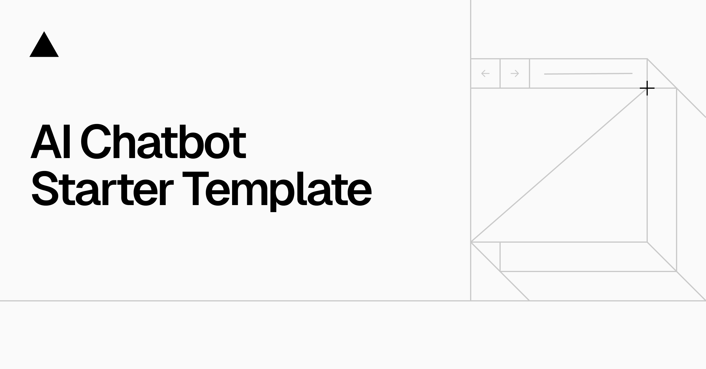

<a href="https://chat.vercel.ai/">
  
  <h1 align="center">Chat SDK</h1>
</a>

<p align="center">
    Chat SDK is a free, open-source template built with Next.js and the AI SDK that helps you quickly build powerful chatbot applications.
</p>

<p align="center">
  <a href="https://chat-sdk.dev"><strong>Read Docs</strong></a> ·
  <a href="#features"><strong>Features</strong></a> ·
  <a href="#model-providers"><strong>Model Providers</strong></a> ·
  <a href="#deploy-your-own"><strong>Deploy Your Own</strong></a> ·
  <a href="#running-locally"><strong>Running locally</strong></a>
</p>
<br/>

## Features

- [Next.js](https://nextjs.org) App Router
  - Advanced routing for seamless navigation and performance
  - React Server Components (RSCs) and Server Actions for server-side rendering and increased performance
- [AI SDK](https://ai-sdk.dev/docs/introduction)
  - Unified API for generating text, structured objects, and tool calls with LLMs
  - Hooks for building dynamic chat and generative user interfaces
  - Supports xAI (default), OpenAI, Fireworks, and other model providers
- [shadcn/ui](https://ui.shadcn.com)
  - Styling with [Tailwind CSS](https://tailwindcss.com)
  - Component primitives from [Radix UI](https://radix-ui.com) for accessibility and flexibility
- Data Persistence
  - [Neon Serverless Postgres](https://vercel.com/marketplace/neon) for saving chat history and user data
  - [Vercel Blob](https://vercel.com/storage/blob) for efficient file storage
- [Auth.js](https://authjs.dev)
  - Simple and secure authentication

## Model Providers

This template uses the [Vercel AI Gateway](https://vercel.com/docs/ai-gateway) to access multiple AI models through a unified interface. The default configuration includes [xAI](https://x.ai) models (`grok-2-vision-1212`, `grok-3-mini`) routed through the gateway.

### AI Gateway Authentication

**For Vercel deployments**: Authentication is handled automatically via OIDC tokens.

**For non-Vercel deployments**: You need to provide an AI Gateway API key by setting the `AI_GATEWAY_API_KEY` environment variable in your `.env.local` file.

With the [AI SDK](https://ai-sdk.dev/docs/introduction), you can also switch to direct LLM providers like [OpenAI](https://openai.com), [Anthropic](https://anthropic.com), [Cohere](https://cohere.com/), and [many more](https://ai-sdk.dev/providers/ai-sdk-providers) with just a few lines of code.

## Deploy Your Own

You can deploy your own version of the Next.js AI Chatbot to Vercel with one click:

[](https://vercel.com/templates/next.js/nextjs-ai-chatbot)

## Running locally

You will need to use the environment variables [defined in `.env.example`](.env.example) to run Next.js AI Chatbot. It's recommended you use [Vercel Environment Variables](https://vercel.com/docs/projects/environment-variables) for this, but a `.env` file is all that is necessary.

> Note: You should not commit your `.env` file or it will expose secrets that will allow others to control access to your various AI and authentication provider accounts.

1. Install Vercel CLI: `npm i -g vercel`
2. Link local instance with Vercel and GitHub accounts (creates `.vercel` directory): `vercel link`
3. Download your environment variables: `vercel env pull`

```bash
pnpm install
pnpm db:migrate # Setup database or apply latest database changes
pnpm dev
```

Your app template should now be running on [localhost:3000](http://localhost:3000).

## TiQology AI Bridge: Rocket ⇄ Devin Workflow

This repository serves as the **AI engine** for TiQology, with a specialized workflow enabling seamless collaboration between Rocket (AI Architect) and Devin (AI Developer).

### Overview

- **Rocket** acts as the AI architect, identifying tasks and providing detailed specifications
- **Devin** acts as the AI developer, implementing tasks and opening pull requests
- **Human oversight** reviews and merges the work

### How It Works

1. **Rocket assigns tasks**: Fills out the template in `playbooks/rocket-devin/ROCKET_TASK_TEMPLATE.md` and adds it to `playbooks/rocket-devin/ROCKET_INBOX.md`

2. **Devin picks up tasks**: Monitors the inbox, creates feature branches, implements solutions, and opens PRs

3. **Status tracking**: Tasks move through states: `TODO` → `IN PROGRESS` → `DONE`

### Quick Start for Rocket

To assign a task to Devin:

1. Copy the template from [`playbooks/rocket-devin/ROCKET_TASK_TEMPLATE.md`](playbooks/rocket-devin/ROCKET_TASK_TEMPLATE.md)
2. Fill out all sections with complete details:
   - Summary and context
   - Target files/areas to modify
   - Clear acceptance criteria
   - Commands to run for validation
3. Paste the filled template into [`playbooks/rocket-devin/ROCKET_INBOX.md`](playbooks/rocket-devin/ROCKET_INBOX.md)
4. Set status to `TODO`

### Quick Start for Devin

To work on a task:

1. Check [`playbooks/rocket-devin/ROCKET_INBOX.md`](playbooks/rocket-devin/ROCKET_INBOX.md) for tasks with status `TODO`
2. Update status to `IN PROGRESS`
3. Create a feature branch (e.g., `feature/task-description`)
4. Implement the solution following the acceptance criteria
5. Open a PR and update the task status to `DONE` with PR link

### Documentation

- **Full workflow guide**: [`playbooks/rocket-devin/ROCKET_DEVIN_WORKFLOW.md`](playbooks/rocket-devin/ROCKET_DEVIN_WORKFLOW.md)
- **Task template**: [`playbooks/rocket-devin/ROCKET_TASK_TEMPLATE.md`](playbooks/rocket-devin/ROCKET_TASK_TEMPLATE.md)
- **Task inbox**: [`playbooks/rocket-devin/ROCKET_INBOX.md`](playbooks/rocket-devin/ROCKET_INBOX.md)
