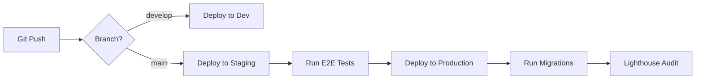

# TiQology: Complete Modular Infrastructure Architecture

## 🏗️ Architecture Overview

TiQology is a next-generation AI-powered platform with a fully modular, scalable, and quantum-ready infrastructure.

```
┌─────────────────────────────────────────────────────────────────┐
│                        TiQology Platform                         │
├─────────────────────────────────────────────────────────────────┤
│                                                                   │
│  ┌───────────────┐  ┌───────────────┐  ┌───────────────┐       │
│  │   Frontend    │  │   Holographic │  │   3D Render   │       │
│  │   (Next.js)   │  │      UI       │  │    Engine     │       │
│  │               │  │   (WebXR)     │  │  (WebGPU/3js) │       │
│  └───────┬───────┘  └───────┬───────┘  └───────┬───────┘       │
│          │                  │                  │                 │
│          └──────────────────┴──────────────────┘                 │
│                          │                                       │
│  ┌───────────────────────┴────────────────────────────┐         │
│  │              API Layer (Edge Functions)            │         │
│  └───────────────────────┬────────────────────────────┘         │
│                          │                                       │
│  ┌─────────────┬─────────┴──────────┬───────────────────┐       │
│  │             │                    │                   │       │
│  │  AI Engine  │   Quantum Engine  │   GPU Accelerator │       │
│  │  (OpenAI/   │   (AWS Braket/    │   (WebGPU/        │       │
│  │  Anthropic) │    Qiskit Mock)   │    GPU.js)        │       │
│  │             │                    │                   │       │
│  └──────┬──────┴────────┬───────────┴─────────┬─────────┘       │
│         │               │                     │                 │
│         └───────────────┴─────────────────────┘                 │
│                         │                                       │
│  ┌──────────────────────┴──────────────────────────┐           │
│  │           Cloud Orchestration Layer             │           │
│  │  ┌──────────┬──────────┬──────────┬──────────┐ │           │
│  │  │  Vercel  │ Supabase │   AWS    │Cloudflare│ │           │
│  │  │  Deploy  │   DB     │  Braket  │   CDN    │ │           │
│  │  └──────────┴──────────┴──────────┴──────────┘ │           │
│  └─────────────────────────────────────────────────┘           │
│                                                                 │
└─────────────────────────────────────────────────────────────────┘
```

## 📦 Module Structure

### 1. **High-Performance Rendering System**

#### WebGPU Engine (`lib/rendering/webgpu-engine.ts`)
- **Purpose**: Hardware-accelerated 3D rendering
- **Features**:
  - Native GPU compute shaders
  - Efficient pipeline management
  - Automatic fallback detection
- **Usage**:
  ```typescript
  import { initializeWebGPU } from '@/lib/rendering/webgpu-engine';
  
  const engine = await initializeWebGPU({ powerPreference: 'high-performance' });
  const pipeline = await engine.createRenderPipeline({
    id: 'main',
    vertexShader: '...',
    fragmentShader: '...'
  });
  ```

#### Three.js Renderer (`lib/rendering/three-renderer.ts`)
- **Purpose**: Fallback and primary 3D engine
- **Features**:
  - Scene management
  - Shadow mapping
  - Animation loops
  - Camera controls
- **Usage**:
  ```typescript
  import { initializeThreeRenderer } from '@/lib/rendering/three-renderer';
  
  const renderer = await initializeThreeRenderer({ antialias: true });
  const scene = await renderer.createScene('main');
  renderer.startAnimationLoop('main');
  ```

### 2. **Holographic UI Layer (WebXR)**

#### Holographic UI (`lib/xr/holographic-ui.tsx`)
- **Purpose**: Immersive XR experiences
- **Components**:
  - `<HolographicUI>` - Main XR container
  - `<HolographicPanel>` - Floating 3D panels
  - `<HolographicButton>` - Interactive 3D buttons
  - `<SpatialAudio>` - 3D positional audio
  - `<HolographicNotification>` - 3D notifications
- **Usage**:
  ```tsx
  import { HolographicUI, HolographicPanel } from '@/lib/xr/holographic-ui';
  
  <HolographicUI enableVR enableHandTracking>
    <HolographicPanel position={[0, 1.6, -2]} title="Dashboard">
      <YourContent />
    </HolographicPanel>
  </HolographicUI>
  ```

#### Three Fiber Scene (`lib/xr/three-fiber-scene.tsx`)
- **Purpose**: React-based 3D scene composition
- **Components**:
  - `<ThreeFiberScene>` - Canvas wrapper
  - `<Model3D>` - 3D model loader
  - `<ParticleSystem>` - GPU particles
  - `<Text3D>` - 3D text rendering
- **Usage**:
  ```tsx
  import { ThreeFiberScene, Model3D } from '@/lib/xr/three-fiber-scene';
  
  <ThreeFiberScene shadows fog>
    <Model3D url="/models/robot.glb" position={[0, 0, 0]} />
  </ThreeFiberScene>
  ```

### 3. **Quantum-Ready Compute Engine**

#### Quantum Engine (`lib/quantum/compute-engine.ts`)
- **Purpose**: Quantum computing abstraction
- **Backends**:
  - AWS Braket (cloud quantum)
  - Qiskit (Python bridge)
  - Mock simulator (development)
- **Features**:
  - Circuit construction
  - Gate operations (H, X, Y, Z, CNOT, RX, RY, RZ)
  - Grover's search algorithm
  - Quantum Fourier Transform
  - VQE preparation
- **Usage**:
  ```typescript
  import { initializeQuantumEngine } from '@/lib/quantum/compute-engine';
  
  const engine = await initializeQuantumEngine('mock');
  const circuit = engine.createCircuit(3);
  engine.addGate(circuit.id, { type: 'H', target: 0 });
  const result = await engine.execute(circuit.id, { shots: 1024 });
  ```

### 4. **AI-Driven Inference System**

#### Inference Pipeline (`lib/ai/inference-pipeline.ts`)
- **Purpose**: Multi-model AI inference
- **Features**:
  - Request batching
  - Response caching
  - Streaming support
  - Chain-of-thought
  - Multi-model consensus
  - Self-refinement
- **Usage**:
  ```typescript
  import { getInferencePipeline } from '@/lib/ai/inference-pipeline';
  
  const pipeline = getInferencePipeline();
  const result = await pipeline.infer(prompt, {
    model: 'gpt-4',
    temperature: 0.7,
    cache: true
  });
  ```

#### GPU Acceleration (`lib/ai/gpu-acceleration.ts`)
- **Purpose**: Hardware-accelerated ML operations
- **Features**:
  - Matrix multiplication
  - Convolution operations
  - Activation functions (ReLU, Softmax)
  - Attention mechanism
  - Custom kernel compilation
- **Usage**:
  ```typescript
  import { initializeGPUAccelerator } from '@/lib/ai/gpu-acceleration';
  
  const gpu = await initializeGPUAccelerator({ mode: 'webgpu' });
  const result = await gpu.matrixMultiply(tensorA, tensorB);
  ```

### 5. **Cloud Orchestration**

#### Orchestration Engine (`lib/cloud/orchestration.ts`)
- **Purpose**: Multi-cloud deployment & management
- **Services**:
  - **Vercel**: Frontend hosting
  - **Supabase**: Database & auth
  - **AWS**: Quantum compute (Braket), Lambda
  - **Cloudflare**: CDN, DNS, Workers
- **Usage**:
  ```typescript
  import { getCloudOrchestrator } from '@/lib/cloud/orchestration';
  
  const orchestrator = getCloudOrchestrator();
  const deployment = await orchestrator.deployFullStack({
    environment: 'production',
    envVars: { ... }
  });
  ```

### 6. **Database Scalability**

#### Scalability Config (`lib/db/scalability.ts`)
- **Purpose**: Postgres optimization
- **Features**:
  - Index strategy (B-tree, unique)
  - Row-Level Security (RLS) policies
  - Connection pooling
  - Query optimization
  - Health monitoring
  - Maintenance automation
- **Usage**:
  ```typescript
  import { applyDatabaseOptimizations } from '@/lib/db/scalability';
  
  const result = await applyDatabaseOptimizations(db);
  console.log(`Applied: ${result.applied.length}, Errors: ${result.errors.length}`);
  ```

### 7. **CI/CD Automation**

#### GitHub Actions Workflows (`.github/workflows/`)
- **`ci-cd-pipeline.yml`**: Main deployment pipeline
  - Quality checks (linting, type checking)
  - Unit & integration tests
  - Security scanning (Trivy, audit)
  - Multi-stage deployment (dev → staging → production)
  - Database migrations
  - Lighthouse performance audits
  
- **`gpu-tests.yml`**: GPU acceleration testing
- **`quantum-tests.yml`**: Quantum engine validation

## 🚀 Quick Start

### Installation

```bash
# Clone repository
git clone <repo-url>
cd ai-chatbot

# Install dependencies
pnpm install

# Setup environment variables
cp .env.example .env.local
# Edit .env.local with your credentials
```

### Required Dependencies

Add to `package.json`:
```json
{
  "dependencies": {
    "three": "^0.160.0",
    "@react-three/fiber": "^8.15.0",
    "@react-three/drei": "^9.96.0",
    "@react-three/xr": "^6.2.0",
    "@webgpu/types": "^0.1.40",
    "gpu.js": "^2.16.0",
    "@aws-sdk/client-braket": "^3.490.0"
  }
}
```

### Environment Variables

```env
# OpenAI
OPENAI_API_KEY=sk-...

# Anthropic
ANTHROPIC_API_KEY=sk-ant-...

# Supabase
NEXT_PUBLIC_SUPABASE_URL=https://...
NEXT_PUBLIC_SUPABASE_ANON_KEY=...
SUPABASE_SERVICE_ROLE_KEY=...
POSTGRES_URL=postgresql://...

# Vercel
VERCEL_TOKEN=...
VERCEL_PROJECT_ID=...
VERCEL_ORG_ID=...

# AWS
AWS_REGION=us-east-1
AWS_ACCESS_KEY_ID=...
AWS_SECRET_ACCESS_KEY=...

# Cloudflare
CLOUDFLARE_ACCOUNT_ID=...
CLOUDFLARE_API_TOKEN=...
CLOUDFLARE_ZONE_ID=...
```

### Development

```bash
# Start dev server
pnpm dev

# Run tests
pnpm test

# Build for production
pnpm build

# Database operations
pnpm db:migrate
pnpm db:studio
```

## 🎯 Feature Matrix

| Feature | Status | Module | Backend |
|---------|--------|--------|---------|
| 3D Rendering | ✅ | WebGPU/Three.js | GPU |
| WebXR Support | ✅ | Holographic UI | Browser XR API |
| Quantum Compute | ✅ | Quantum Engine | AWS Braket/Mock |
| AI Inference | ✅ | Inference Pipeline | OpenAI/Anthropic |
| GPU Acceleration | ✅ | GPU Accelerator | WebGPU/GPU.js |
| Cloud Deploy | ✅ | Orchestration | Vercel/AWS/CF |
| Database RLS | ✅ | Scalability | Supabase Postgres |
| CI/CD | ✅ | GitHub Actions | Multi-stage |

## 📊 Performance Optimizations

### Database
- **Indexes**: Automatic B-tree indexing on frequently queried columns
- **RLS**: Row-level security for multi-tenant isolation
- **Connection Pooling**: 2-10 connections, 30s idle timeout
- **Query Cache**: 5-minute TTL, 100MB max size

### Rendering
- **WebGPU**: Native GPU compute for maximum performance
- **Three.js Fallback**: Graceful degradation for unsupported browsers
- **Shadow Mapping**: PCF soft shadows
- **Pixel Ratio**: Capped at 2x for mobile optimization

### AI Inference
- **Request Batching**: Up to 10 requests per batch
- **Response Caching**: 1-hour TTL on identical prompts
- **Streaming**: Token-by-token for real-time UX
- **Multi-model**: Consensus from multiple LLMs

### Quantum
- **Circuit Optimization**: Gate fusion and simplification
- **Mock Simulator**: Zero-latency development testing
- **AWS Braket**: Production quantum compute on-demand

## 🔐 Security

- **RLS Policies**: Database-level access control
- **Environment Isolation**: Separate dev/staging/prod
- **Dependency Auditing**: Automated via CI/CD
- **Vulnerability Scanning**: Trivy integration
- **Secret Management**: GitHub Secrets for CI/CD

## 🌐 Deployment Strategy



## 🧪 Testing Strategy

- **Unit Tests**: Jest for business logic
- **Integration Tests**: Playwright for E2E
- **GPU Tests**: WebGPU/GPU.js validation
- **Quantum Tests**: Circuit simulation validation
- **Performance**: Lighthouse CI on production

## 📈 Monitoring & Observability

- **Database Metrics**: Connection count, query latency, table sizes
- **Deployment Status**: Real-time via Cloud Orchestrator
- **Inference Stats**: Cache hit rate, latency, token usage
- **Quantum Jobs**: Circuit execution time, success rate

## 🔮 Future Roadmap

- [ ] Real AWS Braket integration for quantum workloads
- [ ] WebXR hand tracking gestures
- [ ] Multi-GPU rendering distribution
- [ ] Edge AI inference (Cloudflare Workers AI)
- [ ] Real-time collaboration in XR spaces
- [ ] Quantum error correction algorithms
- [ ] Neural network quantization for edge devices

## 🤝 Contributing

1. Fork the repository
2. Create a feature branch: `git checkout -b feature/amazing-feature`
3. Commit changes: `git commit -m 'Add amazing feature'`
4. Push to branch: `git push origin feature/amazing-feature`
5. Open a Pull Request

## 📄 License

MIT License - see LICENSE file for details

## 🆘 Support

- **Documentation**: See individual module READMEs
- **Issues**: GitHub Issues for bug reports
- **Discussions**: GitHub Discussions for questions

---

**Built with ❤️ by the TiQology Team**

*Powered by: Next.js • React • TypeScript • WebGPU • Three.js • WebXR • AWS Braket • OpenAI • Supabase • Vercel • Cloudflare*
