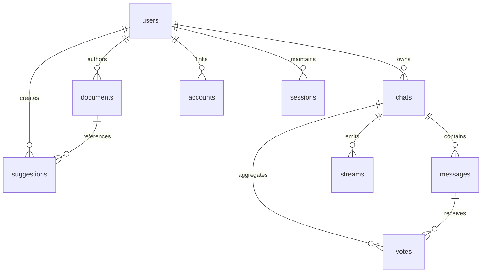

# Database Schema Overview

The application stores all operational data inside Supabase Postgres via Prisma. Authentication tables (Accounts, Sessions, VerificationTokens) live alongside domain entities to ensure referential integrity.

## Tables

| Table | Purpose | Key Fields | Notes |
| --- | --- | --- | --- |
| `users` | Application and auth users | `id`, `email`, `userType` | `userType` enum distinguishes guest vs. registered; `email` unique |
| `chats` | Root container for conversations | `id`, `userId`, `visibility`, `lastContext` | Visibility stored as enum with default `PRIVATE`; cascades delete related messages |
| `messages` | Individual chat messages | `id`, `chatId`, `parts`, `attachments` | `parts` and `attachments` stored as JSONB for dynamic tool payloads; indexed by `chatId`/`createdAt` |
| `votes` | Up/down votes on assistant messages | composite key (`chatId`,`messageId`) | Cascades with chats and messages |
| `documents` | Artifact revisions | composite key (`id`,`createdAt`), `kind` | Each save produces a revision; `kind` enum ensures consistent values |
| `suggestions` | Collaborative editing suggestions | `documentId`, `documentCreatedAt`, `userId` | Foreign key references composite primary key on `documents` |
| `streams` | SSE resumable stream tracking | `id`, `chatId` | Used for resumable streaming IDs |
| `accounts` | NextAuth OAuth accounts | `provider`, `providerAccountId` | Prisma adapter managed |
| `sessions` | NextAuth database sessions | `sessionToken`, `userId` | Rolling sessions enabled |
| `verification_tokens` | Email magic link tokens | `identifier`, `token` | Cleaned up by NextAuth cron |

## Indexing & Constraints

- `users_email_key` guarantees a unique email per user.
- `chats_userId_createdAt_idx` supports reverse chronological chat lists.
- `messages_chatId_createdAt_idx` optimizes message fetches per chat.
- `documents_userId_createdAt_idx` supports per-user document history.
- `suggestions_documentId_documentCreatedAt_idx` accelerates artifact feedback lookups.
- `streams_chatId_createdAt_idx` orders resumable stream IDs.
- Composite keys enforce vote uniqueness (`chatId`,`messageId`) and document revisions (`id`,`createdAt`).
- All foreign keys cascade on delete to maintain referential integrity when chats, messages, or documents are removed.

## Check & Enum Constraints

- `UserType` enum: `GUEST`, `REGULAR`.
- `ChatVisibility` enum: `PUBLIC`, `PRIVATE`.
- `ArtifactKind` enum: `TEXT`, `CODE`, `IMAGE`, `SHEET`.
- Prisma handles application-level validation (e.g., positive `expires` timestamps for sessions). Additional domain checks live inside service logic (`lib/db/queries.ts`).

## Migration Flow

Migrations are generated via `pnpm prisma migrate dev` and applied with `pnpm prisma:deploy`. For CI environments without database access, `prisma migrate diff --from-empty` prebuilds SQL (see `prisma/migrations/`).
