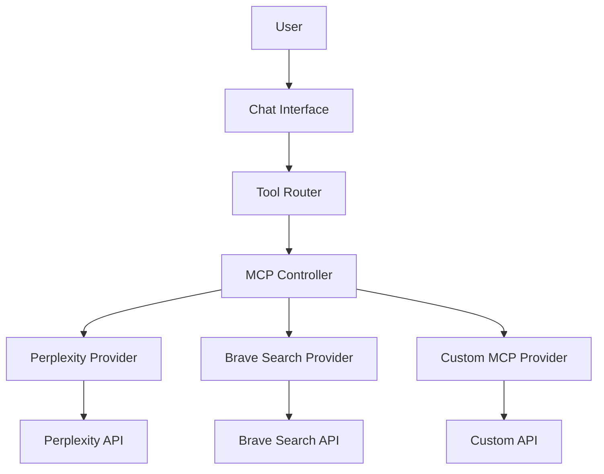
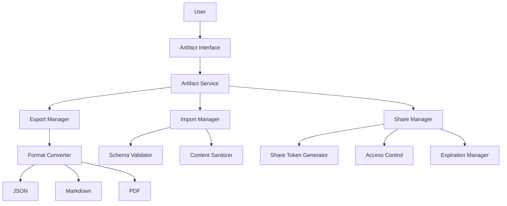

# Advanced Features Technical Specification

**Date Created:** May 11, 2025  
**Status:** Planning  
**Author:** Claude AI Assistant

This document provides a comprehensive technical specification for implementing advanced features in the LostMindAI Chatbot application. The focus areas include MCP server integration, artifact import/export systems, and cloud service integrations.

## Table of Contents
1. [MCP Server Integration](#1-mcp-server-integration)
2. [Advanced Artifact Import/Export System](#2-advanced-artifact-importexport-system)
3. [Database Schema Extensions](#3-database-schema-extensions)
4. [Frontend Components](#4-frontend-components)
5. [Implementation Roadmap](#5-implementation-roadmap)

## 1. MCP Server Integration

### Architecture Overview



### Implementation Details

#### 1.1 MCP Controller Service

```typescript
// lib/mcp/controller.ts
import { MCPProvider, MCPRequest, MCPResponse } from './types';
import { mcpProviders } from './providers';
import { rateLimit, validateRequest } from '../security/validation';

export class MCPController {
  private static instance: MCPController;
  private providers: Record<string, MCPProvider>;
  
  private constructor() {
    this.providers = mcpProviders;
  }
  
  static getInstance(): MCPController {
    if (!MCPController.instance) {
      MCPController.instance = new MCPController();
    }
    return MCPController.instance;
  }
  
  async executeRequest(
    providerName: string, 
    endpoint: string, 
    params: Record<string, any>,
    userId: string
  ): Promise<MCPResponse> {
    // Validate provider exists
    if (!this.providers[providerName]) {
      throw new Error(`Provider "${providerName}" not available`);
    }
    
    const provider = this.providers[providerName];
    
    // Check if endpoint is supported
    if (!provider.endpoints[endpoint]) {
      throw new Error(`Endpoint "${endpoint}" not supported by provider`);
    }
    
    // Rate limit check
    await rateLimit.check(userId, providerName);
    
    // Validate request params
    validateRequest(params, provider.paramSchemas[endpoint]);
    
    // Format request for provider
    const formattedRequest = provider.configureRequest(params, endpoint);
    
    // Execute request
    try {
      const response = await this.makeRequest(
        provider.baseURL,
        provider.endpoints[endpoint],
        formattedRequest,
        provider.headers
      );
      
      // Transform response to standard format
      return provider.transformResponse(response);
    } catch (error) {
      console.error(`MCP request failed: ${error.message}`);
      throw new Error(`Failed to execute ${providerName} request: ${error.message}`);
    }
  }
  
  private async makeRequest(
    baseURL: string,
    endpoint: string,
    data: any,
    headers: Record<string, string>
  ): Promise<any> {
    // Implement actual HTTP request logic
    // Use fetch or axios with proper error handling
  }
}
```

#### 1.2 Provider Configuration

```typescript
// lib/mcp/providers.ts
import { MCPProvider } from './types';
import { perplexitySchema, braveSchema } from './schemas';

export const mcpProviders: Record<string, MCPProvider> = {
  perplexity: {
    name: 'Perplexity',
    baseURL: 'https://api.perplexity.ai',
    endpoints: {
      ask: '/ask',
      research: '/research',
      reason: '/reason'
    },
    paramSchemas: {
      ask: perplexitySchema.ask,
      research: perplexitySchema.research,
      reason: perplexitySchema.reason
    },
    headers: {
      'Content-Type': 'application/json',
      'Authorization': `Bearer ${process.env.PERPLEXITY_API_KEY}`
    },
    configureRequest: (params, endpoint) => {
      // Format request based on endpoint
      if (endpoint === 'ask') {
        return {
          messages: [
            { role: 'user', content: params.query }
          ]
        };
      }
      // Handle other endpoints...
    },
    transformResponse: (response) => {
      // Transform response to standard format
      return {
        content: response.answer,
        metadata: {
          provider: 'perplexity',
          timestamp: new Date().toISOString()
        }
      };
    }
  },
  
  brave: {
    name: 'Brave Search',
    baseURL: 'https://api.search.brave.com',
    endpoints: {
      web: '/web',
      news: '/news',
      videos: '/videos'
    },
    // Additional configuration...
  }
};
```

#### 1.3 Tool Definitions for AI SDK

```typescript
// lib/ai/tools/mcp-tools.ts
import { MCPController } from '../../mcp/controller';

export const mcpTools = [
  {
    type: "function",
    function: {
      name: "perplexity_research",
      description: "Perform deep research on a topic using Perplexity AI",
      parameters: {
        type: "object",
        properties: {
          query: { 
            type: "string",
            description: "The research question or topic to investigate"
          },
          depth: { 
            type: "string",
            enum: ["basic", "deep"],
            description: "The depth of research to perform"
          }
        },
        required: ["query"]
      }
    }
  },
  {
    type: "function",
    function: {
      name: "brave_web_search",
      description: "Search the web using Brave Search",
      parameters: {
        type: "object",
        properties: {
          query: { 
            type: "string",
            description: "The search query"
          },
          count: { 
            type: "number",
            description: "Number of results to return (1-20)"
          }
        },
        required: ["query"]
      }
    }
  }
  // Additional tools...
];

// Tool handler implementation
export async function handleMCPToolCall(toolName: string, params: any, userId: string) {
  const controller = MCPController.getInstance();
  
  // Map tool names to provider/endpoint combinations
  const toolMap = {
    'perplexity_research': { provider: 'perplexity', endpoint: 'research' },
    'brave_web_search': { provider: 'brave', endpoint: 'web' }
    // Additional mappings...
  };
  
  const { provider, endpoint } = toolMap[toolName];
  
  if (!provider || !endpoint) {
    throw new Error(`Unknown tool: ${toolName}`);
  }
  
  return await controller.executeRequest(provider, endpoint, params, userId);
}
```

#### 1.4 API Routes for Tool Calls

```typescript
// app/api/mcp/route.ts
import { NextRequest, NextResponse } from 'next/server';
import { getServerSession } from 'next-auth';
import { MCPController } from '@/lib/mcp/controller';
import { validateRequestBody } from '@/lib/security/validation';

export async function POST(req: NextRequest) {
  try {
    const session = await getServerSession();
    
    // Require authentication
    if (!session || !session.user) {
      return NextResponse.json({ error: 'Unauthorized' }, { status: 401 });
    }
    
    const body = await req.json();
    
    // Validate request body
    validateRequestBody(body, {
      provider: { type: 'string', required: true },
      endpoint: { type: 'string', required: true },
      params: { type: 'object', required: true }
    });
    
    const { provider, endpoint, params } = body;
    
    // Execute MCP request
    const controller = MCPController.getInstance();
    const result = await controller.executeRequest(
      provider, 
      endpoint, 
      params, 
      session.user.id
    );
    
    return NextResponse.json(result);
  } catch (error) {
    console.error('MCP API error:', error);
    return NextResponse.json(
      { error: error.message || 'Internal server error' }, 
      { status: error.status || 500 }
    );
  }
}
```

## 2. Advanced Artifact Import/Export System

### Architecture Overview



### Implementation Details

#### 2.1 Core Artifact Service

```typescript
// lib/artifacts/artifact-service.ts
import { db } from '@/lib/db';
import { 
  ExportManager, 
  ImportManager, 
  ShareManager 
} from './managers';
import { ArtifactType, ExportFormat, ImportOptions, ShareOptions } from './types';

export class ArtifactService {
  private exportManager: ExportManager;
  private importManager: ImportManager;
  private shareManager: ShareManager;
  
  constructor() {
    this.exportManager = new ExportManager();
    this.importManager = new ImportManager();
    this.shareManager = new ShareManager();
  }
  
  // Core CRUD operations
  async getArtifact(id: string, userId: string) {
    return await db.artifact.findFirst({
      where: { id, userId },
      include: { content: true, metadata: true }
    });
  }
  
  async createArtifact(data: any, userId: string) {
    // Implementation...
  }
  
  async updateArtifact(id: string, data: any, userId: string) {
    // Implementation...
  }
  
  async deleteArtifact(id: string, userId: string) {
    // Implementation...
  }
  
  // Export functionality
  async exportArtifact(id: string, format: ExportFormat, userId: string) {
    const artifact = await this.getArtifact(id, userId);
    
    if (!artifact) {
      throw new Error('Artifact not found');
    }
    
    return await this.exportManager.exportArtifact(artifact, format);
  }
  
  // Import functionality
  async importArtifact(data: any, options: ImportOptions, userId: string) {
    const validatedData = await this.importManager.validateAndSanitize(data, options);
    return await this.createArtifact(validatedData, userId);
  }
  
  // Share functionality
  async shareArtifact(id: string, options: ShareOptions, userId: string) {
    const artifact = await this.getArtifact(id, userId);
    
    if (!artifact) {
      throw new Error('Artifact not found');
    }
    
    return await this.shareManager.createShareToken(artifact, options);
  }
  
  async getSharedArtifact(token: string) {
    return await this.shareManager.getSharedArtifact(token);
  }
}
```

#### 2.2 Export Manager Implementation

```typescript
// lib/artifacts/managers/export-manager.ts
import { Artifact, ExportFormat, ExportOptions } from '../types';
import { 
  JsonExporter, 
  MarkdownExporter, 
  PdfExporter 
} from '../exporters';

export class ExportManager {
  private exporters: Record<ExportFormat, any>;
  
  constructor() {
    this.exporters = {
      json: new JsonExporter(),
      markdown: new MarkdownExporter(),
      pdf: new PdfExporter()
    };
  }
  
  async exportArtifact(
    artifact: Artifact, 
    format: ExportFormat,
    options?: ExportOptions
  ) {
    if (!this.exporters[format]) {
      throw new Error(`Unsupported export format: ${format}`);
    }
    
    // Track export activity for analytics
    await this.trackExportActivity(artifact.id, format);
    
    // Execute export
    return await this.exporters[format].export(artifact, options);
  }
  
  private async trackExportActivity(artifactId: string, format: ExportFormat) {
    // Log export activity for analytics
    // Implementation...
  }
}

// Sample exporter implementation
// lib/artifacts/exporters/markdown-exporter.ts
import { Artifact, ExportOptions } from '../types';

export class MarkdownExporter {
  async export(artifact: Artifact, options?: ExportOptions) {
    // Generate metadata section
    const metadata = `---
title: ${artifact.title}
created: ${artifact.createdAt}
type: ${artifact.type}
id: ${artifact.id}
---\n\n`;
    
    // Generate content based on artifact type
    let content = '';
    
    switch (artifact.type) {
      case 'chat':
        content = this.chatToMarkdown(artifact.content);
        break;
      case 'text':
        content = artifact.content.text;
        break;
      case 'code':
        content = this.codeToMarkdown(artifact.content);
        break;
      // Handle other types...
    }
    
    return metadata + content;
  }
  
  private chatToMarkdown(chatContent: any) {
    // Convert chat messages to markdown
    return chatContent.messages.map(msg => {
      const role = msg.role === 'user' ? '**User**' : '**AI**';
      return `${role}: ${msg.content}\n\n`;
    }).join('');
  }
  
  private codeToMarkdown(codeContent: any) {
    // Convert code artifact to markdown
    return `\`\`\`${codeContent.language}\n${codeContent.code}\n\`\`\``;
  }
}
```

#### 2.3 Import Manager Implementation

```typescript
// lib/artifacts/managers/import-manager.ts
import { sanitizeHtml } from '@/lib/security/sanitization';
import { 
  ArtifactSchema, 
  ImportOptions 
} from '../types';
import { ZodSchema } from 'zod';
import { artifactSchemas } from '../schemas';

export class ImportManager {
  async validateAndSanitize(data: any, options: ImportOptions) {
    // Determine schema based on data format and type
    const schema = this.getSchema(data.type, options.format);
    
    // Validate against schema
    try {
      schema.parse(data);
    } catch (error) {
      throw new Error(`Invalid artifact format: ${error.message}`);
    }
    
    // Sanitize content to prevent XSS
    return this.sanitizeArtifact(data);
  }
  
  private getSchema(type: string, format: string): ZodSchema {
    // Get appropriate schema based on artifact type and format
    if (!artifactSchemas[type] || !artifactSchemas[type][format]) {
      throw new Error(`No schema available for ${type}/${format}`);
    }
    
    return artifactSchemas[type][format];
  }
  
  private sanitizeArtifact(data: any) {
    // Deep clone to avoid mutating original
    const sanitized = JSON.parse(JSON.stringify(data));
    
    // Sanitize text content
    if (data.type === 'text' && data.content?.text) {
      sanitized.content.text = sanitizeHtml(data.content.text);
    }
    
    // Sanitize chat messages
    if (data.type === 'chat' && Array.isArray(data.content?.messages)) {
      sanitized.content.messages = data.content.messages.map(msg => ({
        ...msg,
        content: typeof msg.content === 'string' 
          ? sanitizeHtml(msg.content) 
          : msg.content
      }));
    }
    
    // Additional type-specific sanitization...
    
    return sanitized;
  }
}
```

#### 2.4 Share Manager Implementation

```typescript
// lib/artifacts/managers/share-manager.ts
import { nanoid } from 'nanoid';
import { db } from '@/lib/db';
import { Artifact, ShareOptions } from '../types';

export class ShareManager {
  async createShareToken(artifact: Artifact, options: ShareOptions) {
    // Generate a unique token
    const token = nanoid(16);
    
    // Calculate expiration date
    const expiresAt = options.expiresInDays 
      ? new Date(Date.now() + options.expiresInDays * 24 * 60 * 60 * 1000)
      : null;
    
    // Store share information in database
    const shareRecord = await db.artifactShare.create({
      data: {
        token,
        artifactId: artifact.id,
        userId: artifact.userId,
        expiresAt,
        accessLevel: options.accessLevel || 'readonly',
        allowedEmails: options.allowedEmails || [],
        password: options.password ? await this.hashPassword(options.password) : null
      }
    });
    
    // Return share information
    return {
      token,
      url: `${process.env.NEXT_PUBLIC_APP_URL}/share/${token}`,
      expiresAt: shareRecord.expiresAt
    };
  }
  
  async getSharedArtifact(token: string, password?: string) {
    // Find share record
    const shareRecord = await db.artifactShare.findUnique({
      where: { token },
      include: { artifact: true }
    });
    
    if (!shareRecord) {
      throw new Error('Share not found or expired');
    }
    
    // Check expiration
    if (shareRecord.expiresAt && new Date() > shareRecord.expiresAt) {
      throw new Error('Share link has expired');
    }
    
    // Verify password if required
    if (shareRecord.password) {
      if (!password) {
        throw new Error('Password required');
      }
      
      const passwordValid = await this.verifyPassword(
        password, 
        shareRecord.password
      );
      
      if (!passwordValid) {
        throw new Error('Invalid password');
      }
    }
    
    // Return artifact
    return shareRecord.artifact;
  }
  
  private async hashPassword(password: string) {
    // Use bcrypt or similar for secure password hashing
    // Implementation...
  }
  
  private async verifyPassword(password: string, hash: string) {
    // Verify password against hash
    // Implementation...
  }
}
```

#### 2.5 API Routes for Artifact Operations

```typescript
// app/api/artifacts/[id]/export/route.ts
import { NextRequest, NextResponse } from 'next/server';
import { getServerSession } from 'next-auth';
import { ArtifactService } from '@/lib/artifacts/artifact-service';

export async function GET(
  req: NextRequest,
  { params }: { params: { id: string } }
) {
  try {
    const session = await getServerSession();
    
    // Require authentication
    if (!session || !session.user) {
      return NextResponse.json({ error: 'Unauthorized' }, { status: 401 });
    }
    
    const format = req.nextUrl.searchParams.get('format') || 'json';
    const service = new ArtifactService();
    
    // Export artifact
    const result = await service.exportArtifact(
      params.id,
      format as any,
      session.user.id
    );
    
    // Set appropriate headers based on format
    const headers: HeadersInit = {};
    const fileName = `artifact-${params.id}`;
    
    switch (format) {
      case 'json':
        headers['Content-Type'] = 'application/json';
        headers['Content-Disposition'] = `attachment; filename="${fileName}.json"`;
        break;
      case 'markdown':
        headers['Content-Type'] = 'text/markdown';
        headers['Content-Disposition'] = `attachment; filename="${fileName}.md"`;
        break;
      case 'pdf':
        headers['Content-Type'] = 'application/pdf';
        headers['Content-Disposition'] = `attachment; filename="${fileName}.pdf"`;
        break;
    }
    
    return new NextResponse(result, { headers });
  } catch (error) {
    console.error('Export API error:', error);
    return NextResponse.json(
      { error: error.message || 'Internal server error' }, 
      { status: error.status || 500 }
    );
  }
}
```

```typescript
// app/api/artifacts/import/route.ts
import { NextRequest, NextResponse } from 'next/server';
import { getServerSession } from 'next-auth';
import { ArtifactService } from '@/lib/artifacts/artifact-service';

export async function POST(req: NextRequest) {
  try {
    const session = await getServerSession();
    
    // Require authentication
    if (!session || !session.user) {
      return NextResponse.json({ error: 'Unauthorized' }, { status: 401 });
    }
    
    const formData = await req.formData();
    const file = formData.get('file') as File;
    
    if (!file) {
      return NextResponse.json(
        { error: 'No file provided' }, 
        { status: 400 }
      );
    }
    
    // Determine format from file type
    const format = this.getFormatFromContentType(file.type);
    
    // Read file content
    const fileContent = await file.text();
    let artifactData;
    
    // Parse content based on format
    try {
      if (format === 'json') {
        artifactData = JSON.parse(fileContent);
      } else if (format === 'markdown') {
        // Parse markdown (more complex implementation needed)
        artifactData = parseMarkdown(fileContent);
      } else {
        throw new Error(`Unsupported import format: ${format}`);
      }
    } catch (error) {
      return NextResponse.json(
        { error: `Failed to parse file: ${error.message}` }, 
        { status: 400 }
      );
    }
    
    // Import artifact
    const service = new ArtifactService();
    const result = await service.importArtifact(
      artifactData,
      { format },
      session.user.id
    );
    
    return NextResponse.json(result);
  } catch (error) {
    console.error('Import API error:', error);
    return NextResponse.json(
      { error: error.message || 'Internal server error' }, 
      { status: error.status || 500 }
    );
  }
  
  private getFormatFromContentType(contentType: string) {
    if (contentType === 'application/json') return 'json';
    if (contentType === 'text/markdown') return 'markdown';
    if (contentType === 'text/plain') {
      // Try to determine format by examining content
      // Implementation...
    }
    return 'unknown';
  }
}
```

## 3. Database Schema Extensions

To support these features, we'll need to extend your Drizzle schema:

```typescript
// lib/db/schema.ts

// MCP Tool Usage tracking
export const mcpToolUsage = pgTable('MCPToolUsage', {
  id: uuid('id').primaryKey().notNull().defaultRandom(),
  userId: uuid('userId')
    .notNull()
    .references(() => user.id),
  provider: varchar('provider', { length: 64 }).notNull(),
  endpoint: varchar('endpoint', { length: 64 }).notNull(),
  tokenCount: integer('tokenCount'),
  status: varchar('status', { enum: ['success', 'failure'] }).notNull(),
  errorMessage: text('errorMessage'),
  createdAt: timestamp('createdAt').notNull(),
});

// Artifact sharing
export const artifactShare = pgTable('ArtifactShare', {
  id: uuid('id').primaryKey().notNull().defaultRandom(),
  token: varchar('token', { length: 64 }).notNull().unique(),
  artifactId: uuid('artifactId')
    .notNull()
    .references(() => document.id),
  userId: uuid('userId')
    .notNull()
    .references(() => user.id),
  expiresAt: timestamp('expiresAt'),
  accessLevel: varchar('accessLevel', { 
    enum: ['readonly', 'comment', 'edit'] 
  }).notNull().default('readonly'),
  allowedEmails: json('allowedEmails').notNull().default([]),
  password: varchar('password', { length: 255 }),
  createdAt: timestamp('createdAt').notNull(),
  lastAccessedAt: timestamp('lastAccessedAt'),
  accessCount: integer('accessCount').notNull().default(0),
});

// User subscription/usage tracking
export const userSubscription = pgTable('UserSubscription', {
  id: uuid('id').primaryKey().notNull().defaultRandom(),
  userId: uuid('userId')
    .notNull()
    .references(() => user.id),
  plan: varchar('plan', { 
    enum: ['free', 'basic', 'premium', 'enterprise'] 
  }).notNull().default('free'),
  mcpQuota: integer('mcpQuota').notNull().default(50),
  mcpUsage: integer('mcpUsage').notNull().default(0),
  artifactQuota: integer('artifactQuota').notNull().default(10),
  artifactCount: integer('artifactCount').notNull().default(0),
  startDate: timestamp('startDate').notNull(),
  endDate: timestamp('endDate'),
  autoRenew: boolean('autoRenew').notNull().default(false),
});
```

## 4. Frontend Components

Here are key frontend components needed to implement these features:

### 4.1 MCP Tool Integration UI

```tsx
// components/mcp/tool-selector.tsx
'use client';

import { useState } from 'react';
import { Button } from '@/components/ui/button';
import { Tabs, TabsContent, TabsList, TabsTrigger } from '@/components/ui/tabs';
import { MCPToolCard } from './tool-card';

export function MCPToolSelector({ onSelectTool }) {
  const [activeCategory, setActiveCategory] = useState('search');
  
  const toolsByCategory = {
    search: [
      {
        id: 'perplexity_research',
        name: 'Research',
        description: 'Deep research on any topic',
        provider: 'Perplexity',
        icon: '🔍'
      },
      {
        id: 'brave_web_search',
        name: 'Web Search',
        description: 'Search the web for information',
        provider: 'Brave',
        icon: '🌐'
      }
    ],
    utilities: [
      // Other tools...
    ]
  };
  
  return (
    <div className="border rounded-lg p-4">
      <h3 className="text-lg font-medium mb-4">Select a Tool</h3>
      
      <Tabs value={activeCategory} onValueChange={setActiveCategory}>
        <TabsList className="mb-4">
          <TabsTrigger value="search">Search</TabsTrigger>
          <TabsTrigger value="utilities">Utilities</TabsTrigger>
        </TabsList>
        
        {Object.entries(toolsByCategory).map(([category, tools]) => (
          <TabsContent key={category} value={category} className="mt-0">
            <div className="grid grid-cols-1 md:grid-cols-2 gap-3">
              {tools.map(tool => (
                <MCPToolCard
                  key={tool.id}
                  tool={tool}
                  onClick={() => onSelectTool(tool.id)}
                />
              ))}
            </div>
          </TabsContent>
        ))}
      </Tabs>
    </div>
  );
}
```

### 4.2 Artifact Sharing UI

```tsx
// components/artifacts/share-dialog.tsx
'use client';

import { useState } from 'react';
import { 
  Dialog, 
  DialogContent, 
  DialogHeader,
  DialogTitle,
  DialogDescription 
} from '@/components/ui/dialog';
import { Button } from '@/components/ui/button';
import { Input } from '@/components/ui/input';
import { Label } from '@/components/ui/label';
import { Switch } from '@/components/ui/switch';
import { Tabs, TabsContent, TabsList, TabsTrigger } from '@/components/ui/tabs';
import { shareArtifact } from '@/lib/actions/artifact-actions';

export function ShareArtifactDialog({ 
  artifactId, 
  isOpen, 
  onClose 
}) {
  const [accessLevel, setAccessLevel] = useState('readonly');
  const [expiresInDays, setExpiresInDays] = useState(7);
  const [requirePassword, setRequirePassword] = useState(false);
  const [password, setPassword] = useState('');
  const [shareLink, setShareLink] = useState('');
  const [isLoading, setIsLoading] = useState(false);
  
  async function handleShare() {
    setIsLoading(true);
    
    try {
      const options = {
        accessLevel,
        expiresInDays,
        password: requirePassword ? password : undefined
      };
      
      const result = await shareArtifact(artifactId, options);
      setShareLink(result.url);
    } catch (error) {
      console.error('Failed to share artifact:', error);
      // Show error toast/message
    } finally {
      setIsLoading(false);
    }
  }
  
  function handleCopyLink() {
    navigator.clipboard.writeText(shareLink);
    // Show success toast
  }
  
  return (
    <Dialog open={isOpen} onOpenChange={onClose}>
      <DialogContent className="sm:max-w-[450px]">
        <DialogHeader>
          <DialogTitle>Share Artifact</DialogTitle>
          <DialogDescription>
            Create a link to share this artifact with others
          </DialogDescription>
        </DialogHeader>
        
        {!shareLink ? (
          <div className="space-y-4 py-4">
            <Tabs defaultValue="link" className="w-full">
              <TabsList className="grid grid-cols-2">
                <TabsTrigger value="link">Share Link</TabsTrigger>
                <TabsTrigger value="embed">Embed</TabsTrigger>
              </TabsList>
              
              <TabsContent value="link" className="space-y-4 mt-4">
                <div className="space-y-2">
                  <Label>Access Level</Label>
                  <select
                    className="w-full rounded-md border border-input p-2"
                    value={accessLevel}
                    onChange={(e) => setAccessLevel(e.target.value)}
                  >
                    <option value="readonly">View Only</option>
                    <option value="comment">Allow Comments</option>
                    <option value="edit">Full Edit Access</option>
                  </select>
                </div>
                
                <div className="space-y-2">
                  <Label>Link Expiration</Label>
                  <select
                    className="w-full rounded-md border border-input p-2"
                    value={expiresInDays}
                    onChange={(e) => setExpiresInDays(Number(e.target.value))}
                  >
                    <option value={1}>1 day</option>
                    <option value={7}>7 days</option>
                    <option value={30}>30 days</option>
                    <option value={0}>Never</option>
                  </select>
                </div>
                
                <div className="flex items-center justify-between">
                  <Label htmlFor="require-password">
                    Require Password
                  </Label>
                  <Switch
                    id="require-password"
                    checked={requirePassword}
                    onCheckedChange={setRequirePassword}
                  />
                </div>
                
                {requirePassword && (
                  <div className="space-y-2">
                    <Label htmlFor="password">Password</Label>
                    <Input
                      id="password"
                      type="password"
                      value={password}
                      onChange={(e) => setPassword(e.target.value)}
                      placeholder="Enter a password"
                    />
                  </div>
                )}
              </TabsContent>
              
              <TabsContent value="embed" className="space-y-4 mt-4">
                <div className="space-y-2">
                  <Label>Embed Type</Label>
                  <select
                    className="w-full rounded-md border border-input p-2"
                  >
                    <option value="iframe">iFrame</option>
                    <option value="script">Script</option>
                  </select>
                  
                  <div className="mt-4">
                    <p className="text-sm text-muted-foreground mb-2">
                      Embedded content will reflect the current state
                      of the artifact and will be view-only.
                    </p>
                  </div>
                </div>
              </TabsContent>
            </Tabs>
            
            <div className="flex justify-end gap-2">
              <Button variant="outline" onClick={onClose}>
                Cancel
              </Button>
              <Button onClick={handleShare} disabled={isLoading}>
                {isLoading ? 'Creating...' : 'Create Share Link'}
              </Button>
            </div>
          </div>
        ) : (
          <div className="space-y-4 py-4">
            <div className="space-y-2">
              <Label>Share Link</Label>
              <div className="flex gap-2">
                <Input
                  value={shareLink}
                  readOnly
                  className="flex-1"
                />
                <Button onClick={handleCopyLink} size="sm">
                  Copy
                </Button>
              </div>
              
              <p className="text-sm text-muted-foreground mt-2">
                {expiresInDays > 0 
                  ? `This link will expire in ${expiresInDays} days.` 
                  : 'This link will never expire.'}
                
                {requirePassword && ' A password will be required to access.'}
              </p>
            </div>
            
            <div className="flex justify-end gap-2">
              <Button onClick={onClose}>
                Done
              </Button>
            </div>
          </div>
        )}
      </DialogContent>
    </Dialog>
  );
}
```

## 5. Implementation Roadmap

Here's a proposed roadmap for implementing these features:

1. **Phase 1: Foundational Work (2-3 weeks)**
   - Set up database schema extensions
   - Create core service classes
   - Implement security controls

2. **Phase 2: MCP Integration (2-3 weeks)**
   - Implement MCP Controller
   - Add initial providers (Perplexity, Brave)
   - Create AI SDK tool definitions
   - Build UI components

3. **Phase 3: Artifact System (2-3 weeks)**
   - Implement export/import managers
   - Create format converters
   - Build sharing infrastructure
   - Create UI components

4. **Phase 4: Testing & Optimization (1-2 weeks)**
   - End-to-end testing
   - Performance optimization
   - Security auditing
   - Documentation

5. **Phase 5: Advanced Features (Ongoing)**
   - Additional MCP providers
   - Enhanced sharing capabilities
   - Usage analytics
   - Collaborative editing

This technical specification provides a comprehensive blueprint for implementing the advanced features required to transform the LostMindAI Chatbot into a standalone, powerful AI application with enhanced capabilities.