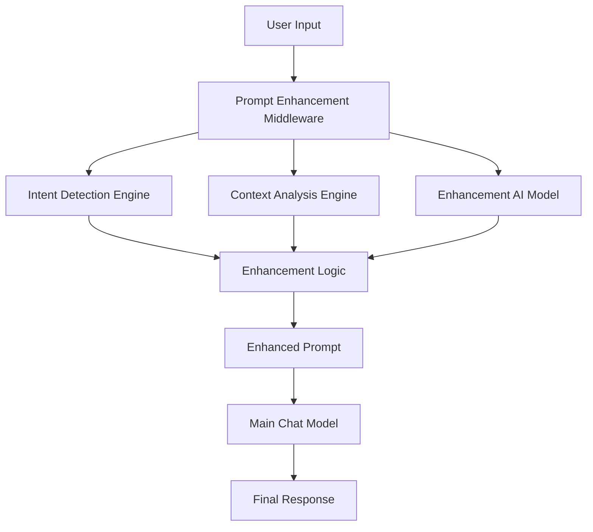

# Intelligent Prompt Enhancement Middleware

The Intelligent Prompt Enhancement Middleware is a powerful preprocessing layer that intercepts user inputs before they reach the main chat model. It analyzes user prompts for intent, sentiment, and context, then enhances or reformulates them to optimize the final response quality and format.

## 🎯 Core Objectives

- **Intent Detection**: Automatically identify what the user is trying to achieve
- **Context Enhancement**: Add missing context and formatting specifications  
- **Prompt Clarification**: Transform vague requests into specific, actionable queries
- **Format Optimization**: Suggest structured output formats when beneficial
- **Response Quality**: Improve the relevance and usefulness of AI responses

## 🚀 Value Proposition

- Reduces user effort in crafting effective prompts
- Ensures consistent, high-quality responses regardless of user prompt sophistication
- Improves user experience by anticipating needs and providing better formatted responses
- Bridges the gap between casual user input and optimal AI model interaction

## 🏗️ Architecture

### System Components



### Component Overview

1. **Intent Detection Engine** (`intent-detector.ts`)
   - Analyzes user prompts to identify intent categories
   - Classifies prompt types (vague, specific, multi-part, etc.)
   - Extracts keywords and confidence levels

2. **Context Analysis Engine** (`context-analyzer.ts`)
   - Analyzes sentiment and emotion
   - Detects vagueness levels
   - Identifies missing context and format specifications
   - Assesses prompt complexity

3. **Enhancement AI Interface** (`enhancement-ai.ts`)
   - Interfaces with AI models for sophisticated enhancements
   - Reformulates prompts based on analysis
   - Adds context and suggests formats

4. **Template Engine** (`template-engine.ts`)
   - Applies enhancement templates for common patterns
   - Manages enhancement rules and configurations
   - Provides fast, rule-based improvements

5. **Main Prompt Enhancer** (`prompt-enhancer.ts`)
   - Orchestrates all enhancement components
   - Manages the enhancement pipeline
   - Provides fallback mechanisms

## 📦 Installation & Setup

### Prerequisites

- Node.js 18+
- OpenRouter API key for enhancement model
- Existing whatsonyourmind project setup

### Configuration

The enhancement middleware is configured through environment variables:

```bash
# Required for enhancement AI model
OPENROUTER_API_KEY=your_openrouter_api_key
```

### Database Setup

Run the database migration to create the enhancement tracking table:

```bash
npx drizzle-kit push:pg
```

## 🎮 Usage

### Basic Usage

```typescript
import { enhancePrompt } from '@/lib/ai/enhancement/prompt-enhancer';

// Simple enhancement
const result = await enhancePrompt('help me code');
console.log(result.enhanced); // Enhanced version of the prompt

// With context
const contextualResult = await enhancePrompt('create app', {
  userContext: session.user,
  chatHistory: previousMessages,
  selectedModel: 'chat-model'
});
```

### Advanced Configuration

```typescript
import { createPromptEnhancer } from '@/lib/ai/enhancement/prompt-enhancer';

const customEnhancer = createPromptEnhancer({
  thresholds: {
    vaguenessThreshold: 0.8,
    confidenceThreshold: 0.7,
    maxEnhancementLength: 800
  },
  features: {
    intentDetection: true,
    contextEnhancement: true,
    formatSuggestion: true,
    sentimentAnalysis: false
  }
});

const result = await customEnhancer.process('user input');
```

### Chat API Integration

The middleware is automatically integrated into the chat API route. When a user sends a message:

1. Text content is extracted from message parts
2. Enhancement context is created with user info and chat history
3. Prompt is analyzed and enhanced if needed
4. Enhanced message is used for AI model processing
5. Enhancement metadata is optionally stored in the database

## 🧪 Enhancement Examples

### Example 1: Vague Request Enhancement

**Input:** `\"help\"`

**Enhanced:** `\"Please provide detailed information about: help

Include relevant context, examples, and practical applications where appropriate.\"`

**Changes Applied:**
- Detail expansion: Added context request
- Clarification: Specified information format

### Example 2: Code Request Enhancement

**Input:** `\"write function\"`

**Enhanced:** `\"Please create code that accomplishes the following:

Requirements:
write function

Format the response as:
1. Brief explanation of the approach
2. Complete, well-commented code
3. Usage example
4. Any important considerations or limitations\"`

**Changes Applied:**
- Context addition: Added code-specific requirements
- Format specification: Structured output format
- Detail expansion: Added technical guidelines

### Example 3: Comparison Request Enhancement

**Input:** `\"compare React vs Vue\"`

**Enhanced:** `\"Please provide a detailed comparison addressing: compare React vs Vue

Structure your response as:
1. Overview of items being compared
2. Comparison table with key criteria
3. Pros and cons for each option
4. Recommendations based on different use cases\"`

**Changes Applied:**
- Format specification: Structured comparison format
- Structure improvement: Clear organization

## ⚙️ Configuration Options

### Enhancement Configuration

```typescript
interface EnhancementConfig {
  // Model configuration for enhancement AI
  enhancementModel: {
    modelId: string;           // 'enhancement-model'
    maxTokens: number;         // 500
    temperature: number;       // 0.3
    systemPrompt: string;
  };
  
  // Processing thresholds
  thresholds: {
    vaguenessThreshold: number;     // 0.7
    confidenceThreshold: number;    // 0.8
    processingTimeLimit: number;    // 3000ms
    maxEnhancementLength: number;   // 1000
    minPromptLength: number;        // 10
  };
  
  // Feature flags
  features: {
    intentDetection: boolean;       // true
    contextEnhancement: boolean;    // true
    formatSuggestion: boolean;      // true
    sentimentAnalysis: boolean;     // true
    templateApplication: boolean;   // true
  };
  
  // Enhancement rules
  rules: {
    expandShortPrompts: boolean;    // true
    addFormatInstructions: boolean; // true
    includeExamples: boolean;       // false
    clarifyAmbiguity: boolean;      // true
    enhanceCodeRequests: boolean;   // true
    structureComparisons: boolean;  // true
  };
}
```

### Template Configuration

The system includes built-in templates for common enhancement patterns:

- **Vague Request Clarification**: Expands unclear queries
- **Code Request Enhancement**: Adds technical specifications
- **Comparison Request**: Structures comparison formats
- **Explanation Request**: Adds comprehensive guidance
- **Step-by-step Request**: Structures procedural responses

## 📊 Monitoring & Analytics

### Enhancement Metadata

The system tracks enhancement performance through the `PromptEnhancement` database table:

```sql
CREATE TABLE \"PromptEnhancement\" (
  \"id\" uuid PRIMARY KEY,
  \"messageId\" uuid NOT NULL,
  \"originalPrompt\" text NOT NULL,
  \"enhancedPrompt\" text NOT NULL,
  \"confidence\" json NOT NULL,
  \"changes\" json NOT NULL,
  \"analysis\" json NOT NULL,
  \"processingTime\" json NOT NULL,
  \"enhancementType\" varchar DEFAULT 'hybrid',
  \"createdAt\" timestamp NOT NULL
);
```

### Analytics Functions

```typescript
// Get enhancement statistics
const stats = await getEnhancementStats({
  userId: 'user-id',
  startDate: new Date('2024-01-01'),
  endDate: new Date('2024-12-31')
});

// Get enhancement by message
const enhancement = await getPromptEnhancementByMessageId({
  messageId: 'message-id'
});
```

## 🧪 Testing

### Running Tests

```bash
# Run enhancement unit tests
npm test tests/enhancement/

# Run integration tests
npm test tests/enhancement/integration.test.ts

# Run demonstration script
ts-node scripts/demo-enhancement.ts
```

### Test Coverage

The test suite covers:

- Intent detection accuracy
- Context analysis functionality  
- Template application logic
- Enhancement pipeline integration
- Error handling and fallbacks
- Performance characteristics
- API integration scenarios

## 🚀 Performance

### Performance Characteristics

- **Average Processing Time**: 200-800ms per enhancement
- **Template-only Enhancement**: 50-150ms
- **AI-assisted Enhancement**: 500-2000ms
- **Fallback Response**: <50ms

### Optimization Strategies

1. **Template-first Approach**: Fast rule-based enhancements before AI
2. **Confidence Thresholds**: Skip enhancement for high-quality prompts
3. **Processing Timeouts**: Fallback to original prompt if enhancement takes too long
4. **Caching**: Template results cached for common patterns

## 🛡️ Error Handling

### Fallback Mechanisms

1. **AI Model Failure**: Falls back to template-based enhancement
2. **Template Failure**: Falls back to rule-based enhancement
3. **Complete Failure**: Returns original prompt with error logging
4. **Timeout**: Returns best available enhancement within time limit

### Error Scenarios

- Network connectivity issues
- AI model rate limiting
- Invalid input handling
- Configuration errors
- Processing timeouts

## 🔧 Troubleshooting

### Common Issues

1. **Enhancement not working**
   - Check OPENROUTER_API_KEY environment variable
   - Verify enhancement model availability
   - Check configuration thresholds

2. **Slow performance**
   - Adjust processingTimeLimit setting
   - Disable AI enhancement for faster template-only mode
   - Check network connectivity to AI provider

3. **Unexpected enhancements**
   - Adjust vaguenessThreshold and confidenceThreshold
   - Review template patterns and rules
   - Check intent detection accuracy

### Debug Mode

```typescript
// Enable debug logging
const result = await enhancePrompt('test input');
console.log('Enhancement details:', {
  analysis: result.analysis,
  changes: result.changes,
  processingTime: result.processingTime
});
```

## 🔮 Future Enhancements

### Planned Features

1. **Learning System**: Adapt enhancement patterns based on user feedback
2. **Custom Templates**: User-defined enhancement templates
3. **A/B Testing**: Compare enhancement strategies
4. **Multi-language Support**: Enhancement for non-English prompts
5. **Domain-specific Enhancement**: Specialized enhancement for different fields

### Roadmap

- **Phase 1** ✅: Core enhancement pipeline
- **Phase 2** ⏳: Advanced AI integration
- **Phase 3** 📋: Learning and adaptation
- **Phase 4** 📋: Multi-modal enhancement

## 📚 API Reference

### Core Functions

#### `enhancePrompt(input, context?, config?)`

Enhances a single prompt with optional context and configuration.

**Parameters:**
- `input` (string): The user's original prompt
- `context` (EnhancementContext, optional): Context information
- `config` (Partial<EnhancementConfig>, optional): Custom configuration

**Returns:** `Promise<EnhancedPrompt>`

#### `createPromptEnhancer(config?)`

Creates a reusable prompt enhancer instance.

**Parameters:**
- `config` (Partial<EnhancementConfig>, optional): Custom configuration

**Returns:** `PromptEnhancer`

### Data Types

```typescript
interface EnhancedPrompt {
  original: string;
  enhanced: string;
  changes: Enhancement[];
  confidence: number;
  processingTime: number;
}

interface Enhancement {
  type: EnhancementType;
  description: string;
  section: string;
  rationale: string;
}

interface EnhancementContext {
  userContext?: any;
  chatHistory?: ChatMessage[];
  selectedModel?: string;
  requestHints?: any;
}
```

## 🤝 Contributing

### Development Setup

1. Clone the repository
2. Install dependencies: `npm install`
3. Set up environment variables
4. Run tests: `npm test`
5. Start development server: `npm run dev`

### Code Style

- Follow existing TypeScript conventions
- Add comprehensive tests for new features
- Document public APIs
- Follow the established error handling patterns

## 📄 License

This project is part of the whatsonyourmind chat SDK and follows the same licensing terms.

---

**Built with ❤️ for better AI interactions**

For questions or support, please refer to the main project documentation or create an issue in the repository.