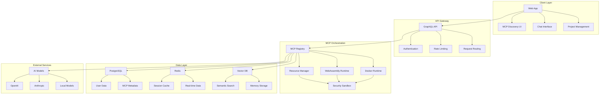

# ChatMCP Pro - Product Requirements Document
## The World's First MCP-Native AI Platform

**Vision:** Build the definitive MCP ecosystem that becomes the operating system for AI agents, capturing the entire value chain from development to deployment to monetization.

**Mission:** Democratize AI agent creation through Model Context Protocol while building a thriving creator economy that scales to serve 100M+ users globally.

---

## Executive Summary

ChatMCP Pro transforms the emerging Model Context Protocol ecosystem into a billion-dollar business by creating the first comprehensive platform that makes MCP development, distribution, and monetization effortless. Unlike traditional AI chat platforms, we're building the "App Store for AI Agents" - a unified ecosystem where creators build, users discover, and enterprises deploy custom AI solutions at scale.

### Market Opportunity

- **Total Addressable Market:** $50B+ (AI Tools + Developer Tools + Enterprise Software)
- **Serviceable Addressable Market:** $8B (Custom AI Solutions + API Management + Enterprise AI)
- **Serviceable Obtainable Market:** $800M (MCP-native solutions by 2027)

### Key Success Metrics (3-Year Target)
- **100M+ Monthly Active Users** globally
- **1M+ Published MCPs** in marketplace
- **$100M+ Annual Revenue Run Rate**
- **500K+ Active MCP Creators**
- **10K+ Enterprise Customers**

---

## Platform Architecture

### Core Technology Stack (Evolution from Current Base)

| Layer | Current | Enhanced | Rationale |
|-------|---------|----------|-----------|
| **Frontend** | Next.js 15 + React 19 | Next.js 15 + React 19 + PWA | Maintain current foundation, add offline capabilities |
| **MCP Runtime** | None | Docker + WebAssembly + K8s | Security, scalability, multi-tenancy |
| **Backend** | Next.js API + Drizzle | FastAPI + Next.js + GraphQL | High-performance MCP orchestration |
| **Database** | Vercel Postgres | Distributed PostgreSQL + Redis + Vector DB | Global scale, real-time, semantic search |
| **AI Framework** | AI SDK | AI SDK + LangGraph + Custom MCP SDK | Maintain current strengths, add MCP native support |
| **Infrastructure** | Vercel | Multi-cloud (AWS + Vercel + CF) | Global edge deployment, enterprise compliance |

### MCP-Native Architecture Principles

1. **MCP-First Design**: Every feature built around MCP primitives
2. **Creator Economy**: Revenue sharing, analytics, discovery built-in
3. **Enterprise Ready**: Multi-tenancy, compliance, security from day one
4. **Global Scale**: Multi-region, multi-language, edge deployment
5. **Developer Experience**: SDK, CLI, visual tools, testing framework

---

## Product Roadmap

### Phase 1: MCP Foundation (Q1 2024 - 3 months)
**Goal:** Transform current chat platform into MCP-native foundation

#### Core MCP Integration
- **MCP Runtime Engine**
  - Docker-based MCP server execution
  - Resource limits and security sandboxing
  - Hot-reload and development mode
  - Built-in observability and debugging

- **MCP Discovery & Management**
  - Visual MCP browser with search and filters
  - One-click installation from registry or custom sources
  - MCP configuration UI with parameter validation
  - Version management and rollback capabilities

- **Enhanced Chat Interface** (Building on current foundation)
  - Extend current chat UI with MCP tool indicators
  - Real-time MCP execution status and logs
  - Interactive parameter collection for MCP tools
  - Rich response rendering for structured data

- **Project System** (Leverage existing memory system)
  - Extend current memory to support project contexts
  - MCP configurations per project
  - File and knowledge base management
  - Shared prompts and templates

#### Developer Tools
- **MCP SDK & CLI**
  ```bash
  npm install -g @chatmcp/cli
  chatmcp init my-server --template typescript
  chatmcp dev --watch
  chatmcp publish --marketplace
  ```

- **Visual MCP Builder**
  - Drag-and-drop workflow designer
  - Code generation from visual flows
  - Testing and validation framework
  - Integration with existing development tools

#### Success Metrics
- 1,000+ MCP installations
- 100+ custom MCPs created
- 10,000+ MAU
- 50+ community contributors

### Phase 2: Marketplace & Creator Economy (Q2 2024 - 3 months)
**Goal:** Launch thriving MCP marketplace with monetization

#### MCP Marketplace
- **Discovery Platform**
  - Advanced search with semantic matching
  - Category organization and tagging
  - Featured collections and trending MCPs
  - User reviews, ratings, and usage analytics

- **Monetization Framework**
  - Flexible pricing models (free, freemium, subscription, usage-based)
  - 70/30 revenue split (creator/platform)
  - Automated payment processing and tax handling
  - Enterprise licensing and bulk purchasing

- **Creator Dashboard**
  - Revenue analytics and insights
  - User engagement metrics
  - A/B testing for descriptions and pricing
  - Support ticket management

#### Advanced Features
- **MCP Orchestration**
  - Visual workflow builder for chaining MCPs
  - Conditional logic and error handling
  - Parallel execution and optimization
  - Custom triggers and scheduling

- **Team Collaboration**
  - Shared projects and MCP configurations
  - Role-based access control
  - Collaborative editing and comments
  - Enterprise audit logs

#### Success Metrics
- 10,000+ MCPs in marketplace
- $100K+ monthly marketplace GMV
- 1,000+ paid creators
- 100,000+ MAU

### Phase 3: Enterprise & Global Scale (Q3-Q4 2024 - 6 months)
**Goal:** Enterprise readiness and international expansion

#### Enterprise Platform
- **Security & Compliance**
  - SOC2 Type II, ISO 27001, GDPR compliance
  - Enterprise SSO (SAML, OIDC, Active Directory)
  - Private MCP registries and air-gapped deployment
  - Advanced audit logging and data governance

- **Private MCP Development**
  - Enterprise-only MCP sharing and collaboration
  - Private registries with approval workflows
  - Custom branding and white-label options
  - Dedicated infrastructure and SLA guarantees

- **Administration & Analytics**
  - Centralized user and license management
  - Usage analytics and cost optimization
  - Custom policies and restrictions
  - Integration with enterprise tools (Slack, Teams, Jira)

#### Global Expansion
- **Multi-Language Support**
  - 15+ language localizations (UI, docs, support)
  - Regional compliance (GDPR, CCPA, data residency)
  - Local payment methods and currencies
  - Regional marketing and partnerships

- **Performance & Scale**
  - Global CDN and edge deployment
  - Multi-region database replication
  - Auto-scaling and load balancing
  - 99.99% uptime SLA

#### Advanced AI Features
- **Custom Model Integration**
  - Bring your own model (BYOM) support
  - Local model deployment (Ollama, vLLM)
  - Model fine-tuning and optimization
  - Custom embedding and vector storage

- **Advanced Memory & Context**
  - Long-term memory with knowledge graphs
  - Cross-conversation context sharing
  - Semantic memory search and retrieval
  - Memory versioning and rollback

#### Success Metrics
- 10,000+ enterprise seats
- 50+ countries served
- 500K+ active MCPs
- 1M+ MAU globally

---

## Monetization Strategy

### Revenue Streams

#### 1. Subscription Tiers (Primary Revenue - 60%)

| Tier | Price | Target | Key Features |
|------|-------|--------|--------------|
| **Community** | Free | Individual developers | 100 messages/day, 5 MCPs, Basic memory, Community support |
| **Pro** | $29/month | Power users & creators | Unlimited messages, 50 MCPs, Advanced memory, Priority support, Creator analytics |
| **Team** | $89/user/month | Small teams | Everything in Pro + Team collaboration, Shared MCPs, Admin dashboard, SLA |
| **Enterprise** | Custom | Large organizations | Everything + SSO, Compliance, Private MCPs, Dedicated support, Custom SLA |

#### 2. MCP Marketplace (Secondary Revenue - 25%)
- **Transaction Fees**: 30% on all paid MCPs
- **Listing Fees**: Premium placement and promotion
- **Enterprise Licensing**: Volume discounts and custom terms
- **Certification Program**: Verified MCP badges and priority placement

#### 3. Platform Services (Growth Revenue - 15%)
- **MCP Hosting**: Managed infrastructure for complex MCPs
- **Custom Development**: Professional services for enterprise MCPs
- **Training & Certification**: Developer education programs
- **API Access**: Enterprise integration and automation

### Customer Acquisition Strategy

#### Phase 1: Developer Community (Months 1-6)
- **Technical Content Marketing**
  - MCP tutorials, best practices, case studies
  - Open source sample MCPs and templates
  - Developer conference presence and sponsorships
  - Technical blog and documentation site

- **Community Building**
  - Discord/Slack community for developers
  - Monthly MCP showcase events
  - Hackathons and bounty programs
  - GitHub integration and collaboration

#### Phase 2: Creator Economy (Months 6-12)
- **Creator Incentives**
  - Revenue sharing bonuses for top performers
  - Marketing support and featured placement
  - Creator spotlights and case studies
  - Educational resources and workshops

- **Viral Growth Mechanisms**
  - Referral programs for both users and creators
  - Social sharing of MCP creations
  - Embedded MCPs in external websites
  - API partnerships with developer tools

#### Phase 3: Enterprise Expansion (Months 12-24)
- **Direct Sales**
  - Dedicated enterprise sales team
  - Technical pre-sales support
  - Custom demo environments
  - Pilot programs and POCs

- **Partner Channel**
  - System integrator partnerships
  - Technology vendor alliances
  - Consultant and agency programs
  - Reseller and affiliate networks

---

## Technical Implementation

### MCP Runtime Architecture



### Security Architecture

#### MCP Sandboxing
- **Container Isolation**: Each MCP runs in dedicated Docker container
- **Resource Limits**: CPU, memory, network, and storage quotas
- **Network Policies**: Restricted internet access with allowlist
- **File System**: Read-only with limited write access to temp directories
- **API Rate Limiting**: Per-MCP and per-user request limits

#### Data Protection
- **Encryption**: AES-256 at rest, TLS 1.3 in transit
- **Key Management**: Hardware security modules (HSM) for API keys
- **Access Control**: Role-based with principle of least privilege
- **Audit Logging**: Comprehensive logging with tamper protection
- **Data Residency**: Regional data storage for compliance

### Database Schema Extensions

```sql
-- MCP Management
mcps (
  id, name, description, version, creator_id, category,
  pricing_model, price, install_count, rating, status,
  docker_image, config_schema, created_at, updated_at
)

mcp_installations (
  user_id, mcp_id, config, installed_at, last_used
)

mcp_executions (
  id, user_id, mcp_id, input, output, duration, 
  status, error, created_at
)

-- Projects (extending existing schema)
projects (
  id, user_id, name, description, mcp_configs,
  shared_prompts, knowledge_base, settings, created_at
)

-- Marketplace
mcp_purchases (
  id, user_id, mcp_id, price, transaction_id, created_at
)

mcp_reviews (
  id, user_id, mcp_id, rating, comment, created_at
)

-- Enterprise
organizations (
  id, name, plan, billing_info, settings, created_at
)

organization_users (
  org_id, user_id, role, permissions, added_at
)

private_mcps (
  id, org_id, mcp_id, access_level, approved_by, created_at
)
```

---

## User Experience Design

### Core User Journeys

#### 1. Developer Journey: Creating First MCP
```
1. Sign up with GitHub/Google
2. Interactive tutorial: "Build Your First MCP"
3. Use CLI tool to scaffold MCP project
4. Test MCP in development environment
5. Publish to marketplace
6. Monitor usage and earnings
```

#### 2. User Journey: Discovering MCPs
```
1. Browse marketplace by category
2. Preview MCP with interactive demos
3. Install MCP with one-click
4. Configure MCP parameters
5. Use MCP in chat conversation
6. Rate and review MCP
```

#### 3. Enterprise Journey: Team Deployment
```
1. Start with team trial
2. Configure SSO and user management
3. Install approved MCPs for team
4. Create private MCPs for internal use
5. Monitor usage and costs
6. Scale to full enterprise deployment
```

### Design System

#### Component Library (Extending Current shadcn/ui)
- **MCP Browser**: Grid/list view with filters and search
- **MCP Card**: Installation, rating, pricing, preview
- **Configuration Panel**: Dynamic forms based on MCP schema
- **Execution Monitor**: Real-time logs and status indicators
- **Workflow Builder**: Visual MCP chaining interface

#### Accessibility & Internationalization
- **WCAG 2.1 AA Compliance**: Full keyboard navigation, screen reader support
- **RTL Support**: Arabic, Hebrew language support
- **Responsive Design**: Mobile-first with progressive enhancement
- **Dark/Light Themes**: User preference with system detection

---

## Go-to-Market Strategy

### Launch Strategy

#### Pre-Launch (Months -3 to 0)
- **Alpha Testing**: 100 selected developers and power users
- **Content Creation**: Technical documentation, tutorials, case studies
- **Community Building**: Discord server, GitHub organization, early adopters
- **Partnership Outreach**: AI companies, developer tool vendors

#### Launch (Month 0)
- **Product Hunt Launch**: Coordinated launch with developer community
- **Technical PR**: Blog posts, conference talks, podcast appearances
- **Influencer Outreach**: AI/ML thought leaders and developer advocates
- **Free Tier**: Generous free offering to drive adoption

#### Post-Launch (Months 1-6)
- **Feature Iteration**: Based on user feedback and usage analytics
- **Marketplace Growth**: Incentivize high-quality MCP creation
- **Enterprise Outreach**: Direct sales to early enterprise prospects
- **International Expansion**: Localization for key markets

### Competitive Positioning

#### Direct Competitors
- **Strengths vs. ChatGPT**: Native MCP support, creator economy, customization
- **Strengths vs. Claude**: Open ecosystem, enterprise features, cost efficiency
- **Strengths vs. Copilot**: Domain-agnostic, marketplace, community-driven

#### Indirect Competitors
- **vs. Zapier**: More AI-native, conversational interface, MCP ecosystem
- **vs. Hugging Face**: Full application stack, enterprise ready, monetization
- **vs. LangChain**: User-friendly interface, hosted platform, marketplace

---

## Financial Projections

### 3-Year Revenue Forecast

| Year | Subscriptions | Marketplace | Services | Total Revenue | ARR |
|------|---------------|-------------|----------|---------------|-----|
| Y1 | $2M | $500K | $200K | $2.7M | $2.7M |
| Y2 | $15M | $5M | $2M | $22M | $22M |
| Y3 | $50M | $25M | $10M | $85M | $85M |

### Unit Economics (Year 3)

| Metric | Value |
|--------|-------|
| Customer Acquisition Cost (CAC) | $45 |
| Average Revenue Per User (ARPU) | $85/month |
| Lifetime Value (LTV) | $2,040 |
| LTV/CAC Ratio | 45:1 |
| Gross Margin | 85% |
| Net Revenue Retention | 130% |

### Funding Requirements

- **Seed Round**: $3M (completed - product development)
- **Series A**: $15M (scaling, team growth)
- **Series B**: $50M (international expansion, enterprise)
- **Total Funding**: $68M to reach $100M ARR

---

## Risk Analysis & Mitigation

### Technical Risks

| Risk | Impact | Probability | Mitigation |
|------|--------|-------------|------------|
| MCP adoption slow | High | Medium | Strong evangelism, free tools, education |
| Security vulnerabilities | High | Low | Security-first architecture, audits, bug bounty |
| Scaling challenges | Medium | Medium | Cloud-native architecture, performance testing |
| AI model costs | Medium | High | Multi-model support, optimization, pass-through pricing |

### Business Risks

| Risk | Impact | Probability | Mitigation |
|------|--------|-------------|------------|
| Big Tech competition | High | High | First-mover advantage, community lock-in |
| Economic downturn | Medium | Medium | Flexible pricing, strong unit economics |
| Regulatory changes | Medium | Low | Compliance-first approach, legal expertise |
| Talent acquisition | Medium | Medium | Competitive compensation, remote-first culture |

### Market Risks

| Risk | Impact | Probability | Mitigation |
|------|--------|-------------|------------|
| MCP standard changes | High | Low | Active participation in MCP governance |
| Alternative protocols | Medium | Medium | Protocol-agnostic architecture |
| Enterprise sales cycle | Medium | High | Strong ROI demonstration, pilot programs |

---

## Success Metrics & KPIs

### Product Metrics

#### Engagement
- **Daily Active Users (DAU)**: Target 2M by Year 3
- **Session Duration**: Average 25+ minutes
- **Messages per Session**: 15+ messages
- **MCP Usage Rate**: 70%+ of active users

#### Growth
- **Monthly Active Users (MAU)**: 50M by Year 3
- **New User Registration**: 100K+ per month
- **User Retention**: 80%+ Month 1, 60%+ Month 6
- **Viral Coefficient**: 0.3+ (organic growth)

### Business Metrics

#### Revenue
- **Monthly Recurring Revenue (MRR)**: $7M by Year 3
- **Annual Contract Value (ACV)**: $15K enterprise average
- **Revenue per Employee**: $400K+
- **Marketplace Take Rate**: 30%

#### Efficiency
- **Customer Acquisition Cost (CAC)**: <$50
- **CAC Payback Period**: <6 months
- **Net Revenue Retention**: 130%+
- **Gross Revenue Retention**: 95%+

### Ecosystem Metrics

#### Creator Economy
- **Active MCP Creators**: 500K+
- **MCPs Published**: 1M+
- **Creator Revenue**: $50M+ annually
- **Top Creator Earnings**: $100K+ annually

#### Enterprise
- **Enterprise Customers**: 10K+
- **Enterprise Revenue %**: 60%+
- **Enterprise NPS**: 70+
- **Enterprise Churn**: <5% annually

---

## Conclusion

ChatMCP Pro represents a paradigm shift in the AI landscape - from prompt engineering to protocol engineering. By building the world's first MCP-native platform with a thriving creator economy, we're positioned to capture the entire value chain of custom AI development.

Our strategy combines:
1. **Technical Excellence**: MCP-first architecture with enterprise security
2. **Market Timing**: Early position in emerging MCP ecosystem  
3. **Business Model**: Proven SaaS + marketplace hybrid monetization
4. **Global Vision**: Multi-language, multi-region platform from day one
5. **Community Focus**: Creator economy that scales with platform growth

The convergence of AI democratization, developer tool consolidation, and enterprise AI adoption creates a $50B+ market opportunity. By executing this roadmap, ChatMCP Pro will become the definitive platform for AI agent development and deployment, achieving $100M+ ARR and positioning for a $1B+ valuation within 3 years.

**Next Steps:**
1. Complete MCP runtime architecture (Q3 2025)
2. Launch marketplace beta with 100 creators (Q4 2025)  
3. International expansion and enterprise sales (Q4 2025)

The future of AI is not in models - it's in protocols. ChatMCP Pro will be the platform that makes that future accessible to everyone. 